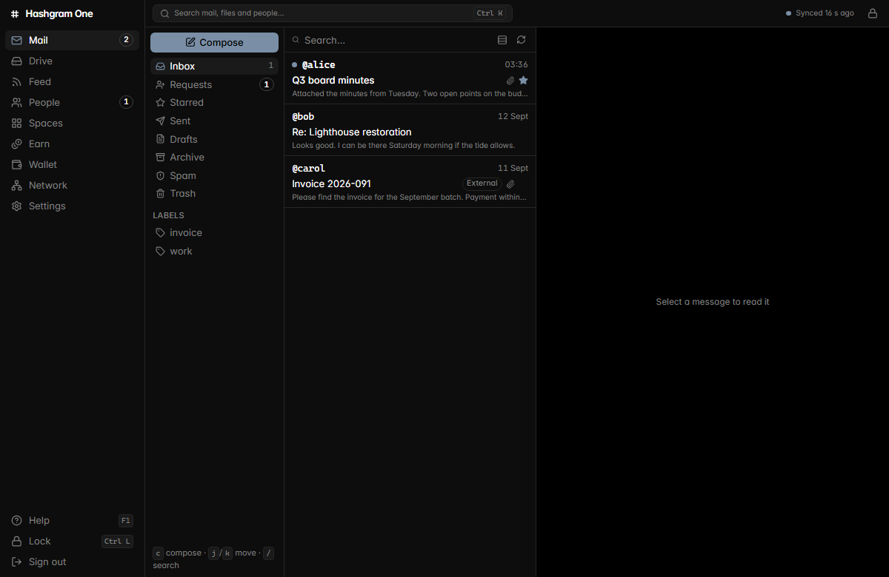
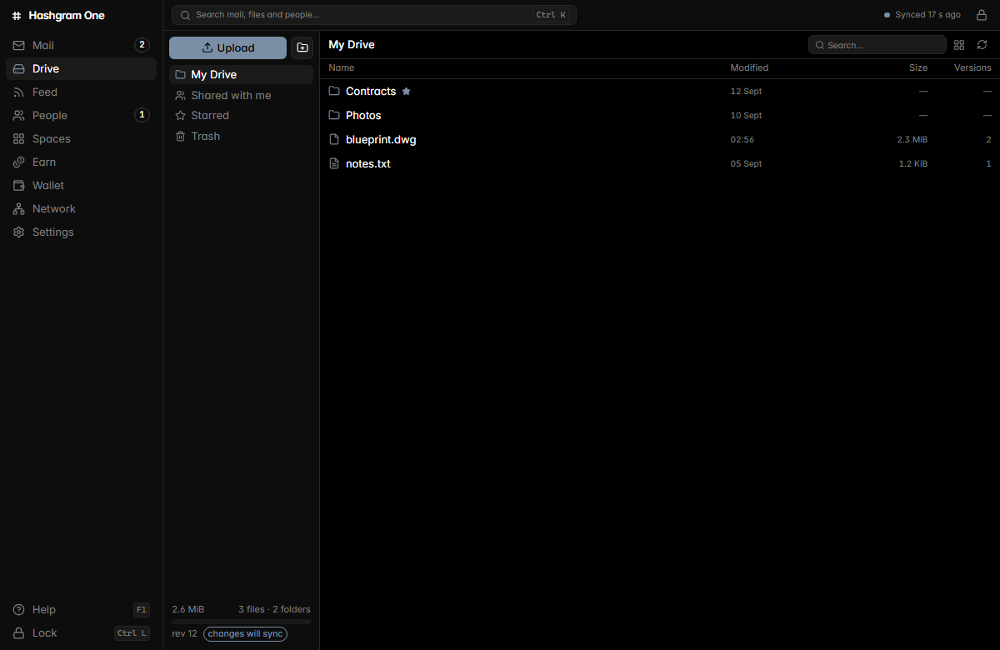
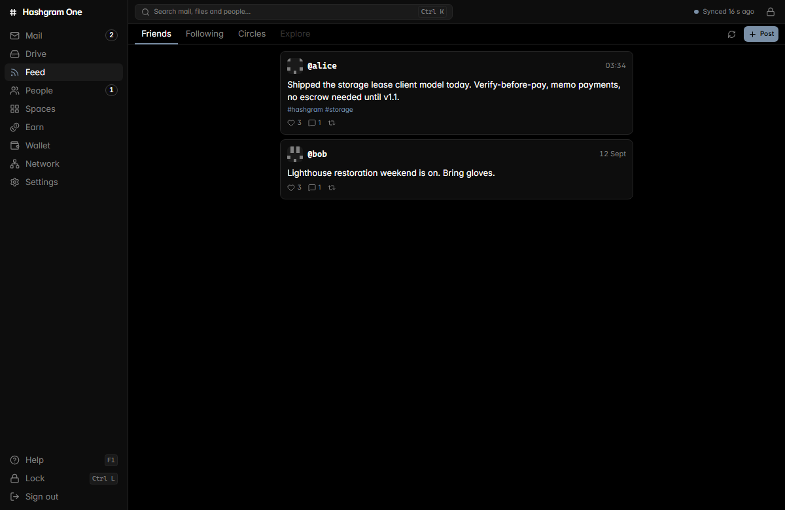
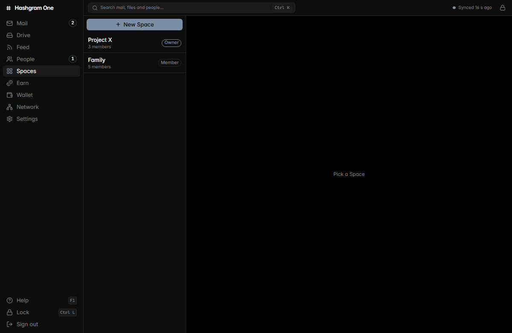
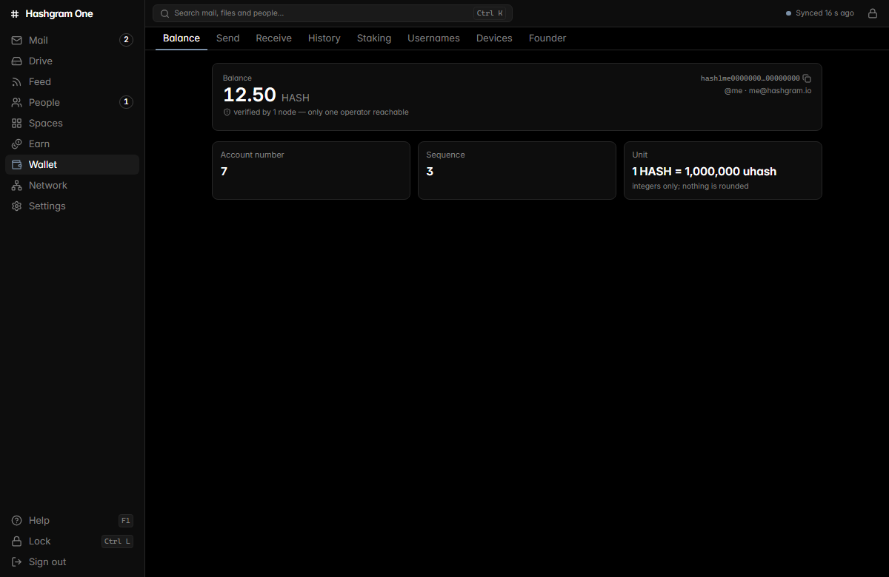
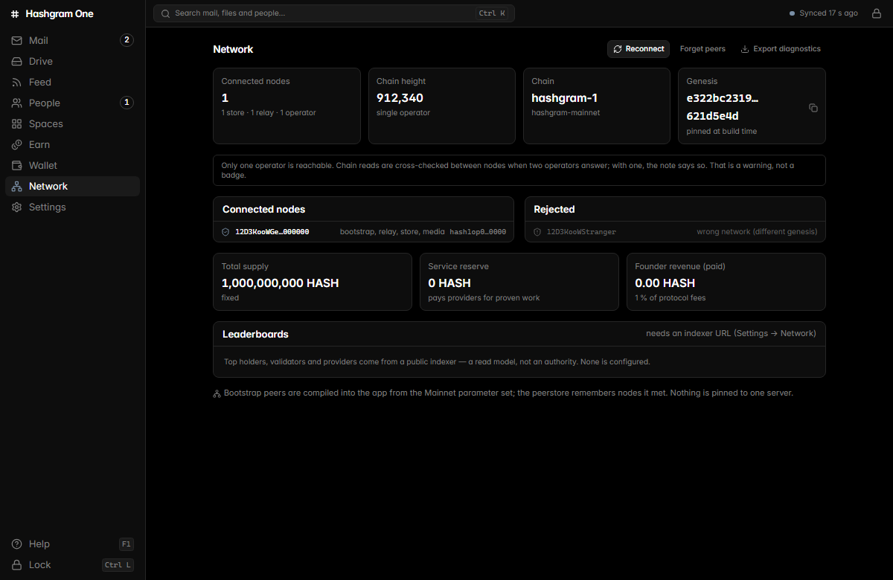
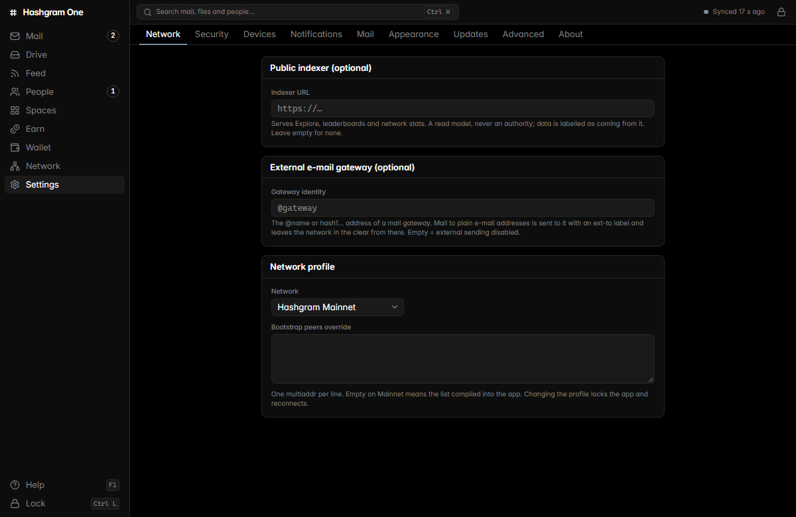
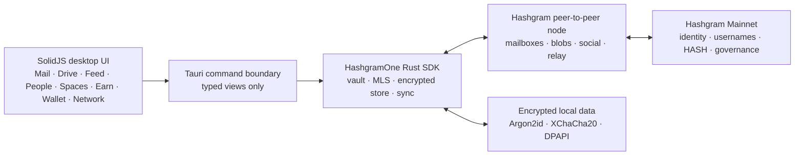

<div align="center">

<picture>
  <source media="(prefers-color-scheme: dark)" srcset="brand/wordmark-white-512.png">
  <source media="(prefers-color-scheme: light)" srcset="brand/wordmark-black-512.png">
  
</picture>

<br><br>

# Hashgram One for Windows

### One identity. One inbox. One vault. One network.

Private Mail, encrypted Drive, People, Feed, Circles, Spaces, Earn, Wallet and Network —<br>
one native desktop application talking to Hashgram's peer-to-peer network, never to one central server.

[](https://github.com/deepdrogo/hashgram_windows/releases/latest)
[](https://hashgram.io)
[](#download)
[](#architecture)
[](LICENSE)

<br>

[**Download v0.2.2**](https://github.com/deepdrogo/hashgram_windows/releases/latest) ·
[**Explore the network**](https://hashgram.io) ·
[**Protocol source**](https://github.com/deepdrogo/hashgram) ·
[**Security model**](docs/SECURITY.md) ·
[**Desktop architecture**](apps/desktop/README.md)

<br>



</div>

---

## What Hashgram One is

Hashgram One is the user-facing workspace built on Hashgram Mainnet. The chain
provides globally agreed identity keys, usernames, balances, provider records
and governance. Private application data does **not** go on chain: mail,
contacts, file names, folder trees, private feeds and Space activity travel
inside MLS ciphertext that relay and storage nodes cannot read.

The Windows application is the first complete desktop client for that model.
Version **0.2.2** was published on **13 September 2026**. It keeps the complete
workspace and the v0.2.1 device/setup improvements, then completes outage
recovery by detecting repeated liveness failures, closing half-open or zombie
P2P connections, clearing stale peer state and re-enabling bootstrap redial
without restarting Hashgram.

| | |
|---|---|
| **Application** | Hashgram One 0.2.2 |
| **Platform** | Windows 10/11 x64 · Tauri 2 · WebView2 |
| **Identity** | One locally generated or restored 24-word identity |
| **Network** | Hashgram Mainnet (`hashgram-1`) through the peer-to-peer SDK |
| **Local data** | Encrypted vault, encrypted SDK store and sealed UI cache |
| **Updates** | Minisign-verified manifest and package from GitHub Releases |
| **Source** | Apache-2.0 |

---

## Product tour

### Mail

- End-to-end encrypted HashMail between `hash1…` identities, `@username` and
  `name@hashgram.io`.
- Inbox, Requests, Starred, Sent, Drafts, Archive, Spam, Trash and labels.
- Threads, CC/BCC, authenticated-sender state and delivery/read receipts.
- Composer with local drafts, file attachments and snapshot/live HashDrive
  attachments.
- Requests workflow for unknown senders: accept, block or delete.
- HTML mail is isolated in a sandboxed iframe under a strict CSP.
- Keyboard workflow: `c` compose, `j/k` move, `Enter` open, `r` reply,
  `e` archive.

### Drive

- Client-side encrypted files in authenticated 1 MiB segments.
- Folders, list/grid views, sorting, search, star and trash.
- Versions with restore and download.
- Snapshot and live capability-based sharing; revoke at any time.
- Shared-with-me workflows and direct Mail attachments from Drive.
- Deterministic encrypted manifests that converge across devices.

### People, Feed and Circles

- On-chain identity resolution with local contact, block, mute and trust state.
- Contact requests over MLS and optional wallet-card disclosure.
- Public signed posts, comments, reactions, reposts, follows and polls.
- Chronological feeds without a ranking algorithm.
- Private Circle posts decrypted and merged on the client.

### Spaces

- Private workspaces for a family, team, company or project.
- Owner, Admin, Member and Guest roles enforced from a signed, hash-chained
  role log.
- Posts, announcements, shared Drive, group Mail and member management.
- Nothing about a private Space is stored on chain.

### Earn, Wallet and Network

- Run or supervise a useful-service node from the PC and inspect provider
  lifecycle, assignments and earnings.
- HASH balance, send/receive, history, staking, usernames and authorised
  devices.
- Preview and confirm transactions before signing; amounts remain integer
  strings end to end.
- Network height, connected/rejected peers, pinned genesis, supply, provider
  reserve and founder-fee transparency.
- Diagnostics export excludes private content, contact addresses and peer IPs.

---

## Screenshots

<table>
<tr>
<td width="50%" align="center"><br><sub><b>Mail</b> — encrypted inbox, requests, labels and local drafts</sub></td>
<td width="50%" align="center"><br><sub><b>Drive</b> — encrypted folders, versions and capability sharing</sub></td>
</tr>
<tr>
<td width="50%" align="center"><br><sub><b>Feed & Circles</b> — signed public posts and private audiences</sub></td>
<td width="50%" align="center"><br><sub><b>Spaces</b> — role-based private workspaces</sub></td>
</tr>
<tr>
<td width="50%" align="center"><br><sub><b>Wallet</b> — HASH, staking, usernames, devices and founder transparency</sub></td>
<td width="50%" align="center"><br><sub><b>Network</b> — peers, chain identity, supply and diagnostics</sub></td>
</tr>
<tr>
<td colspan="2" align="center"><br><sub><b>Settings</b> — network, security, devices, updates, appearance and advanced controls</sub></td>
</tr>
</table>

> The desktop images are rendered from the application's built-in development
> data shim. They show the real v0.2.2 UI and routes without exposing a real
> identity, message, wallet or network credential.

---

## Security and privacy

### The webview never receives secret material

The Tauri frontend receives typed views, not cryptographic objects. The
mnemonic (except its one-time onboarding display and restore field), root
private key, device seed, Drive keys, MLS state, vault passphrase and local
store key remain in Rust.

### Local protection

- Argon2id derives the vault key from the passphrase.
- XChaCha20-Poly1305 seals local records.
- DPAPI and optional Windows Hello protect day-to-day unlock.
- UI caches use SQLite WAL with sensitive columns sealed under a vault-held
  key.
- Temporary decrypted attachments are wiped when the app locks.
- Auto-lock defaults to 15 minutes.
- Recovery words are never copied by the app and blur when the window loses
  focus.

### Network boundaries

- The desktop talks through the in-repository `HashgramOne` SDK.
- `chain_api = None`: there is no mandatory central API.
- Bootstrap peers come from the Mainnet parameter set; one hostname is never
  made load-bearing.
- A peer with the wrong genesis is rejected and shown as a wrong-network peer.
- Private payloads remain MLS-encrypted while stored or relayed.

### Tests enforce the boundary

- Command return types are checked for forbidden secret fields.
- Rust tests inspect files written by the app for plaintext keys, mnemonics,
  mail, drafts and Drive metadata.
- HTML mail is tested for an empty sandbox and strict CSP.
- Notifications are prohibited from containing subjects or file names.
- Source rules reject hard-coded non-loopback IPs, CDN/analytics references,
  floating-point token amounts and forbidden terminology.

---

## How it works



---

## Download

The latest public release is
**[Hashgram One for Windows v0.2.2](https://github.com/deepdrogo/hashgram_windows/releases/tag/v0.2.2)**.

| File | Use |
|---|---|
| `Hashgram.One_0.2.2_x64-setup.exe` | Recommended per-user NSIS installer |
| `Hashgram.One_0.2.2_x64_en-US.msi` | MSI package |
| `SHA256SUMS.txt` | Published SHA-256 checksums |
| `latest.json` + `.sig` files | Signed updater manifest and package signatures |

The updater refuses an unsigned or foreign manifest. The v0.2.2 preview is
**not Authenticode-signed yet**, so Windows SmartScreen may warn on first
install. Verify the package against `SHA256SUMS.txt`. This limitation is stated
explicitly rather than hidden.

---

## Current release status

Implemented and shipped in v0.2.2:

- Mail, Drive, People, Feed, private Circles and role-based Spaces.
- Earn, Wallet, Network, Settings, Help and encrypted backup/restore.
- English and Georgian interface, dark/light appearance and keyboard search.
- Signed self-update through GitHub Releases.
- Mainnet smoke-tested identity, Drive round trip, balance and Network views.
- Automatic P2P link rebuild and reattachment after connectivity returns.
- Persistent device-registration guidance with Mail/Feed submission gated
  until the PC is authorised on chain.
- Explicit network requirements: at least 0.01 HASH for device registration;
  username registration additionally costs 1 HASH.
- Safe sign-out that removes the local vault only after a destructive warning.
- Three-failure liveness tracking that evicts half-open/zombie peers through
  the normal connection-close path and allows bootstrap redial without an app
  restart.

Remaining QA:

- Full clean-Windows-11 definition-of-done pass.
- Two installed PCs exercising the complete add-device and sync flow (the same
  flow is covered at SDK/devnet level).
- Authenticode certificate for removing the initial SmartScreen warning.

---

## Architecture

| Layer | Technology | Responsibility |
|---|---|---|
| UI | SolidJS 1.9 · TypeScript 5.9 · Vite 7 · Tailwind 4 | Routes, views, accessibility, local interaction |
| Desktop core | Tauri 2 · Rust | Commands, session, vault, sync, files, notifications |
| Application boundary | `hashgram-sdk` / `HashgramOne` | Mail, Drive, People, Feed, Spaces, Wallet, provider and network surfaces |
| Local state | encrypted SDK store · sealed SQLite cache | Offline views, indexes and settings |
| Network | Rust libp2p node + Cosmos SDK / CometBFT chain | Ciphertext relay/storage and global consensus |

Read the implementation guide in
[`apps/desktop/README.md`](apps/desktop/README.md), the exact status in
[`docs/DESKTOP_APP_IMPLEMENTATION_CHECKLIST.md`](docs/DESKTOP_APP_IMPLEMENTATION_CHECKLIST.md)
and the protocol boundary in
[`docs/HASHGRAM_ONE_ARCHITECTURE.md`](docs/HASHGRAM_ONE_ARCHITECTURE.md).

---

## Develop

```powershell
pnpm install
cd apps\desktop
pnpm test
pnpm exec tsc --noEmit
pnpm tauri dev
```

For UI-only work, `pnpm dev` uses an in-memory development shim that is
tree-shaken from production builds.

---

## Related projects

| Project | Purpose |
|---|---|
| [deepdrogo/hashgram](https://github.com/deepdrogo/hashgram) | Mainnet chain, P2P node, protocol, SDK, indexer and operator tooling |
| [hashgram.io](https://hashgram.io) | Live read-only explorer, network dashboard and documentation |
| [deepdrogo/hashgram_io](https://github.com/deepdrogo/hashgram_io) | Explorer website and read API contract |

## Licence

Apache-2.0 — see [LICENSE](LICENSE). The Hashgram mark and wordmark identify
the Hashgram network; use them unmodified when referring to it.
