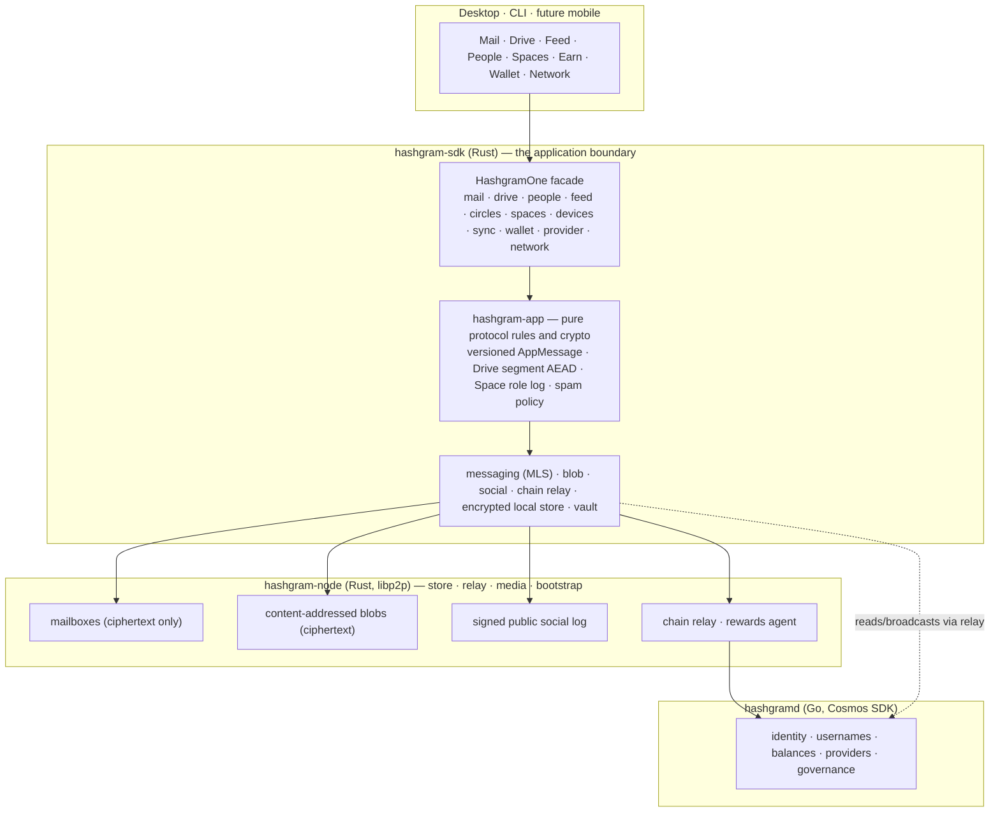
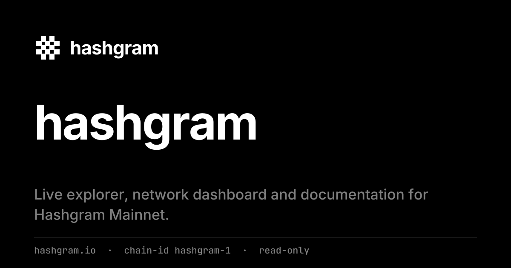
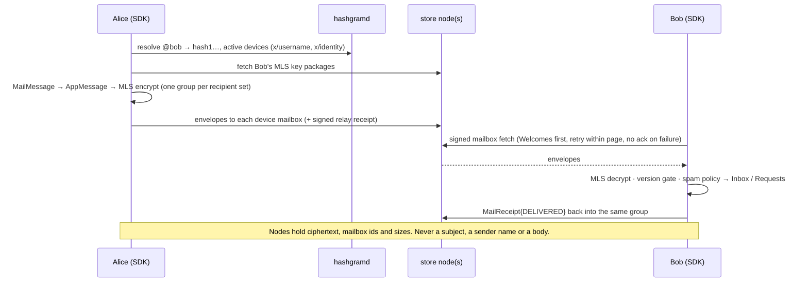
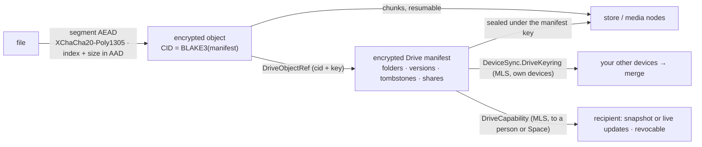
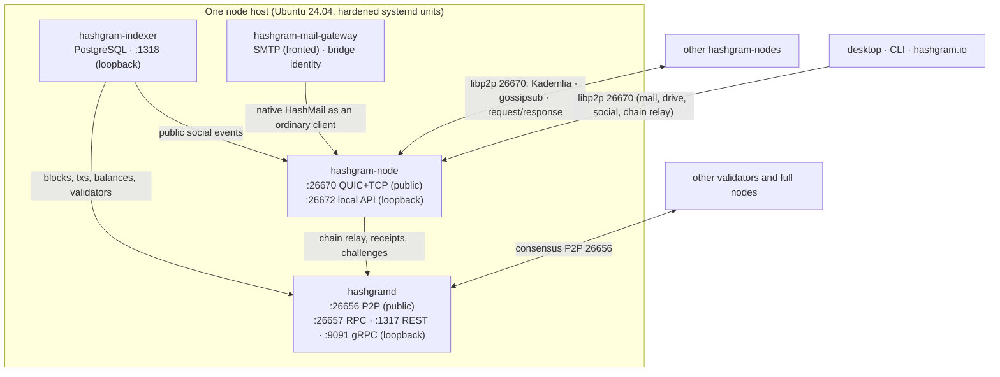
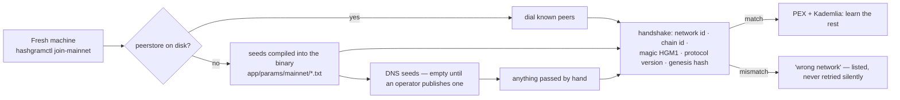
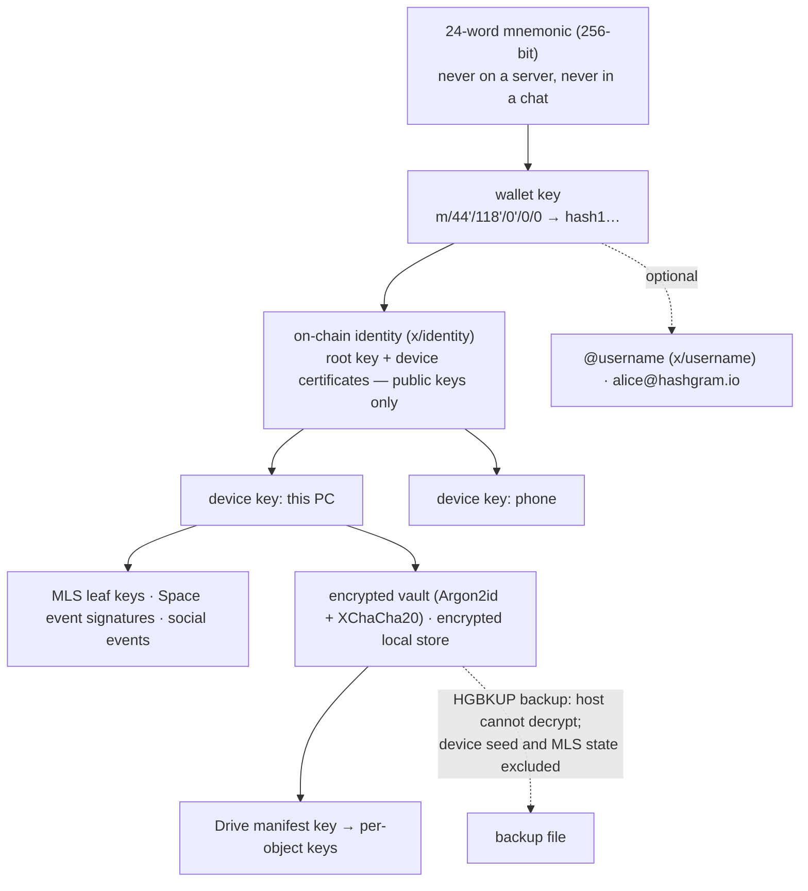
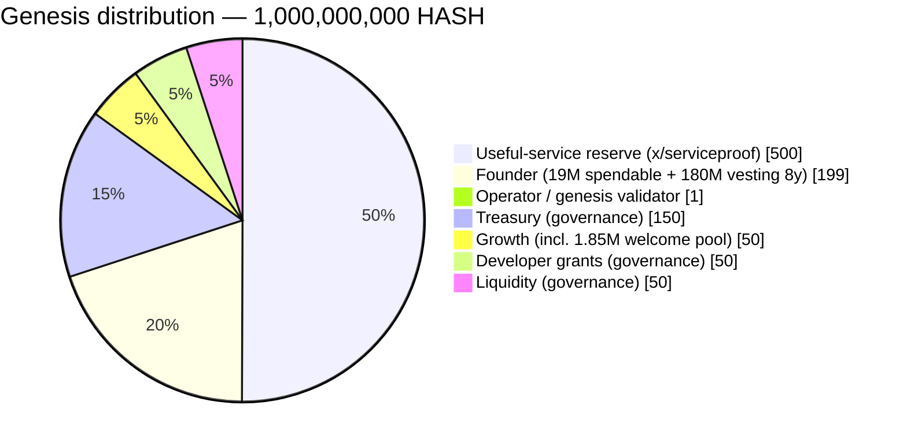

<div align="center">

<picture>
  <source media="(prefers-color-scheme: dark)" srcset="brand/wordmark-white-512.png">
  <source media="(prefers-color-scheme: light)" srcset="brand/wordmark-black-512.png">
  
</picture>

<br><br>

**One identity. One inbox. One vault. One network.**

Private mail, private storage, people, feed and shared spaces —<br>
on a Layer-1 with a fixed supply, a finite reward reserve and no central point of control.

<br>

[](https://github.com/deepdrogo/hashgram/actions/workflows/ci.yml)
[](#mainnet-at-a-glance)
[](#tokenomics)
[](node/Cargo.toml)
[](go.mod)
[](LICENSE)

<br>

[**hashgram.io**](https://hashgram.io) — live explorer &nbsp;·&nbsp;
[**Hashgram One**](#hashgram-one) &nbsp;·&nbsp;
[**Architecture**](docs/HASHGRAM_ONE_ARCHITECTURE.md) &nbsp;·&nbsp;
[**Run a node**](#run-a-node-and-join-mainnet) &nbsp;·&nbsp;
[**Build a client**](#clients) &nbsp;·&nbsp;
[**Docs**](#documentation)

</div>

<br>

Hashgram is one repository: the blockchain (Go, Cosmos SDK v0.53 / CometBFT
v0.38), the peer-to-peer node (Rust, libp2p), the application protocol and
client SDK (Rust), the external mail gateway (Rust), the indexer and safety
engine (Go), the operator tooling, and the genesis that launched Mainnet on
**2026-09-10**. Everything a node runs is here. Everything a client needs is
here. Nothing is hidden behind a service, and nothing private is ever
readable by one.

---

## Hashgram One

Hashgram One is the product built on the network. The blockchain and the
swarm are infrastructure; what a person uses every day is:

| | | Specification |
| --- | --- | --- |
| **Mail** | End-to-end encrypted HashMail between `hash1…` identities, `@alice`, `alice@hashgram.io`. Threads, CC/BCC, attachments, receipts, a Requests folder for strangers, and a gateway to ordinary e-mail — labelled honestly as *not* end-to-end. | [HASHMAIL.md](docs/HASHMAIL.md) · [MAIL_GATEWAY.md](docs/MAIL_GATEWAY.md) |
| **Drive** | HashDrive: files encrypted on your device in authenticated 1 MiB segments, folders, versions, trash, an encrypted manifest that merges deterministically across your devices, and capability-based sharing (snapshot or live) that never makes a file public. | [HASHDRIVE.md](docs/HASHDRIVE.md) |
| **People** | Identities resolved on chain; contact requests over MLS; friend, block, mute and trust state that never leaves your devices; wallet disclosure only when you choose. | [PRIVACY_MODEL.md](docs/PRIVACY_MODEL.md) |
| **Feed** | Public signed posts, comments and reactions in chronological feeds — no ranking algorithm — plus private **Circle** posts (family, close friends) merged client-side. | [SOCIAL_PROTOCOL.md](docs/SOCIAL_PROTOCOL.md) · [SPACES.md](docs/SPACES.md) |
| **Spaces** | Shared environments for a family, company or project: an MLS group plus a signed, hash-chained role log (Owner / Admin / Member / Guest) that every member enforces, with a shared drive, announcements, posts and group mail. Nothing about a Space is on chain. | [SPACES.md](docs/SPACES.md) |
| **Earn** | Run a node, store and relay for others, earn HASH from a finite reserve on evidence — chain-issued storage challenges and client-signed receipts. Never for claimed capacity. | [SERVICE_REWARDS.md](docs/SERVICE_REWARDS.md) · [ADR_HASH_STORAGE_MARKET.md](docs/ADR_HASH_STORAGE_MARKET.md) |
| **Wallet** | One asset, HASH. Balances read through the P2P relay and cross-checked across operators; send, stake, register a username. | [TOKENOMICS.md](docs/TOKENOMICS.md) |
| **Network** | Peers, validators, providers, supply, leaderboards and statistics — from your own node or an indexer you choose, never from a single hard-coded host. | [INDEXER.md](docs/INDEXER.md) |



Every application payload — a mail, a Drive share, a Space event — travels
**inside MLS ciphertext** that no node, relay, store, indexer or gateway
decodes. The chain holds only what needs global agreement: who owns which
keys, names and coins. Everything cryptographic lives in Rust; a client UI
only ever sees views.

What is implemented today, what is partial and what is a future upgrade is
stated precisely in [HASHGRAM_ONE_ARCHITECTURE.md](docs/HASHGRAM_ONE_ARCHITECTURE.md)
and [HASHGRAM_ONE_AI_HANDOFF.md](docs/HASHGRAM_ONE_AI_HANDOFF.md).

---

## Mainnet at a glance

| | |
| --- | --- |
| Chain id | `hashgram-1` |
| Launched | 2026-09-10 13:01:34 UTC |
| Genesis SHA-256 | `e322bc2319f6e0173286fa526dab5a8ff8ad0797c7b80dd03e7c9d98621d5e4d` — compiled into the binaries ([`app/params/mainnet.go`](app/params/mainnet.go), [`node/hashgram-net/src/mainnet.rs`](node/hashgram-net/src/mainnet.rs)) |
| Supply | 1,000,000,000 HASH, fixed. `1 HASH = 1,000,000 uhash`. No mint module. |
| Block time | ~4 s |
| Bech32 prefix / coin type | `hash` / 118 |
| Founder share | 1 % of **protocol fee revenue** (never of transfers), ceiling hardcoded |
| Seed nodes | [`app/params/mainnet/`](app/params/mainnet/) — shared by Go and Rust builds |
| Join | `hashgramctl join-mainnet` — no arguments: genesis, hash and seeds are built in |

Like Bitcoin, the software you choose to run is the out-of-band source of
truth for the genesis. A node whose handshake reports a different genesis
hash is "wrong network", not a peer.

---

## hashgram.io — the official window into the network

<div align="center">
<a href="https://hashgram.io"></a>
</div>

[hashgram.io](https://hashgram.io) is the official, live, **read-only** view
of the network: blocks and decoded transactions, validators and peers, top
balances with module accounts labelled, the reward reserve and every
provider's payouts, the Founder ledger, governance, the documentation and the
read API. It runs on its own full node that joined Mainnet through the same
compiled-in seed list as everyone else, pins the genesis hash, holds no keys,
sets no cookies beyond the theme, and is reproducible from this repository
([`indexer/`](indexer/), [docs/PROMPT_HASHGRAM_IO.md](docs/PROMPT_HASHGRAM_IO.md)).
Anyone can run their own copy against their own node.

---

## Why it is built this way

**Nothing private is on chain, and nothing private is readable by a node.**
Subjects, bodies, recipients, file names, folder trees and share graphs live
only inside MLS groups whose members are the users' on-chain devices. A
store node sees a mailbox id, a size and a time; a media node sees
ciphertext under a content hash. [PRIVACY_MODEL.md](docs/PRIVACY_MODEL.md)
says exactly what each actor can see — including the metadata that cannot
realistically be hidden.

**There is no inflation, and not because a parameter is set to zero.** The
`x/mint` module is not wired into the application at all. Every uhash that
will ever exist was created in the genesis block.
[`app/app.go`](app/app.go) · [`app/app_test.go`](app/app_test.go)

**The Founder's 1 % is a share of protocol fee revenue, never a tax on
transfers.** Send 100 HASH, the recipient gets exactly 100 HASH. The share is
capped at 100 basis points by a compile-time constant governance cannot raise.
[`x/founder`](x/founder) · [`x/feerouter`](x/feerouter)

**Rewards for useful work, not for wasted electricity.** Storage providers
are paid on bytes the network assigned to them and challenges they answered;
relay and media providers on receipts the served client signed. Self-reported
traffic earns nothing; a pair of nodes trading fake receipts is discounted to
20 % of what they claim. The reserve is finite — 500,000,000 HASH spent on a
declining schedule that cannot be topped up.
[`x/serviceproof`](x/serviceproof) · [docs/SERVICE_REWARDS.md](docs/SERVICE_REWARDS.md)

**Accounts are keys.** No sign-up service, e-mail or password database. An
account is a 24-word mnemonic; devices carry their own keys certified by an
offline-capable root; people are found by public key and by an `@username`
registered on chain. A stolen device is revoked on chain and removed from
every group on the next sync. [MULTI_DEVICE_SECURITY.md](docs/MULTI_DEVICE_SECURITY.md)

**The client trusts nobody for content.** Every blob is hash-checked and
authenticated per segment, every social event signature-checked against
on-chain devices, every message authenticated by MLS, every chain read
compared across two operators. Nodes are interchangeable providers of
availability.

**A fork of this software is a different network, and the code says so.**
Network identity is five parts — name, network id, chain id, genesis hash
and a four-byte magic — and every signature is domain-separated by network.
[`x/network`](x/network) · [`node/hashgram-net`](node/hashgram-net)

**No master key, no kill switch, no override.** No administrative
transaction can freeze an account, reverse a transfer, mint a coin or change
the supply. [DECENTRALIZATION.md](docs/DECENTRALIZATION.md) is an honest
account of where control still sits today: one genesis operator.

---

## How it works

### A mail, end to end



### A file, end to end



### Components and how they talk



Administrative interfaces bind to loopback. `hashgramctl mainnet-preflight`
refuses to start a Mainnet node whose RPC is reachable from outside.

### How a new node finds the network



### Keys



---

## The chain

Eight custom modules on top of the standard Cosmos SDK set.

| Module | What it does |
| --- | --- |
| [`x/network`](x/network) | Network identity, genesis hash pinning, signature domain separation |
| [`x/founder`](x/founder) | The Founder revenue ledger and its compile-time fee ceiling |
| [`x/feerouter`](x/feerouter) | Splits protocol fee revenue; never touches transferred principal |
| [`x/welcome`](x/welcome) | Tiered joining reward, 50/5/1/0 HASH, capped at 1,850,000 HASH; off until an attestor exists |
| [`x/serviceproof`](x/serviceproof) | Proof of Useful Service: receipts, storage challenges, bonds, fraud scoring, epoch settlement |
| [`x/username`](x/username) | `@name` registry with confusable-character defence and reserved names |
| [`x/identity`](x/identity) | Root identities, device certificates, social recovery with delay. Public keys only. |
| [`x/treasury`](x/treasury) | Named genesis allocations (treasury, growth, dev grants, liquidity), spendable only by governance |

Standard: `auth`, `bank`, `staking`, `slashing`, `distribution`, `gov`,
`evidence`, `vesting`, `upgrade`, `consensus`, `genutil`, `feegrant`,
`authz`. **Excluded on purpose:** `x/mint`, `x/circuit`.

Governance: voting period 7 days, quorum 40 %, threshold 50 %, veto 33.4 %;
unbonding 21 days; slashing 5 % double-sign, 0.01 % downtime. **Hashgram One
required no consensus change**; the upgrades it recommends are listed in
[HASHGRAM_ONE_ARCHITECTURE.md §12](docs/HASHGRAM_ONE_ARCHITECTURE.md).

---

## Tokenomics



**Emission from the reserve**, per epoch of 21,600 blocks (≈ 1 day):

```text
budget = min( floor(remaining × 5 / 10,000), 250,000 HASH )
```

| After | Paid out (max) | Remaining |
| --- | --- | --- |
| 1 year | ≈ 83.4 M (16.7 %) | ≈ 416.6 M |
| 5 years | ≈ 299.3 M (59.9 %) | ≈ 200.7 M |
| 10 years | ≈ 419.4 M (83.9 %) | ≈ 80.6 M |

The budget is a **ceiling**: one provider takes at most 5 % of an epoch,
unpaid budget stays in the reserve, and credit comes only from real bytes
stored and served. Registration bond 1,000 HASH; fraud → 5 % slash and jail.
There is one asset, HASH — no credits, no storage token. Long-term paid
storage in HASH is designed in [ADR_HASH_STORAGE_MARKET.md](docs/ADR_HASH_STORAGE_MARKET.md).
Everything: [docs/TOKENOMICS.md](docs/TOKENOMICS.md).

---

## Node roles

| Role | Binary | Does | Earns |
| --- | --- | --- | --- |
| `validator` | `hashgramd` | Signs blocks | block fees, staking rewards |
| `relay` | `hashgram-node` | Forwards encrypted envelopes and gossip; relays chain reads for wallets; circuit relay for NAT'd peers | relay receipts |
| `store` | `hashgram-node` | Holds mailboxes, key packages, Drive and media blobs; answers storage challenges | storage assignments × challenges, retrieval receipts |
| `media` | `hashgram-node` | Serves blob manifests and chunks | retrieval receipts |
| `bootstrap` | `hashgram-node` | Helps new nodes find peers | relay receipts |
| `indexer` | `hashgram-indexer` | PostgreSQL read model: chain, balances, validators, providers, public social | — (operator service) |
| `safety` | `hashgram-safety` | Reviews **public** content only, signs verdicts | — (operator service) |
| `gateway` | `hashgram-mail-gateway` | Bridges Internet e-mail to HashMail under an operator's domain | — (operator service) |

Details and hardware guidance: [docs/NODE_ROLES.md](docs/NODE_ROLES.md).

---

## Quick start

### Run a node and join Mainnet

Ubuntu Server 24.04, a public IPv4, ports 26656 and 26670 (TCP+UDP) open.

```bash
git clone https://github.com/deepdrogo/hashgram && cd hashgram
sudo scripts/install/bootstrap-ubuntu.sh        # users, dirs, firewall, PostgreSQL (loopback), binaries, units

hashgramctl init --moniker <your-name>
hashgramctl join-mainnet                        # genesis, hash and seeds are compiled in
hashgramctl network-info                        # pin must read e322bc23…5e4d
hashgramctl configure-role relay,store,media \
  --declared-storage 500000000000 \
  --reward-address hash1<a cold address you wrote down>
hashgramctl start
hashgramctl chain-status                        # wait for catching_up = false
```

To earn, fund the operator address printed by `configure-role` with
≥ 1,000 HASH (bond) plus fees and set `auto_register_provider = true` in
`/etc/hashgram/node.toml`. To become a validator: [docs/MAINNET.md](docs/MAINNET.md).
Never copy `priv_validator_key.json` between machines.

### Build from source

Go 1.26.x, Rust ≥ 1.90 (protobuf is compiled with pure-Rust `protox`; no
`protoc` needed).

```bash
make build                                                  # Go binaries into build/
cd node && cargo build --release --locked \
  -p hashgram-node -p hashgram-client -p hashgram-mail-gateway
make test && make rust-test                                 # Go (-race) and Rust tests
make ci                                                     # everything CI runs
```

### Use Hashgram One from a terminal, against Mainnet, with no server address

```bash
export HASHGRAM_PASSPHRASE='a strong passphrase'
hashgram-client configure --network mainnet \
  --genesis-hash e322bc2319f6e0173286fa526dab5a8ff8ad0797c7b80dd03e7c9d98621d5e4d
hashgram-client identity create                 # 24 words shown once; keep them offline

hashgram-client one sync                        # mailbox · outbox · feed · balance · devices
hashgram-client one drive put report.pdf /      # encrypted on this machine, stored on the network
hashgram-client one drive get /report.pdf out.pdf
hashgram-client one mail send --to @bob --subject "Contract" --body "see attached" \
  --attach-drive-live <entry-id>                # a live Drive attachment
hashgram-client one people request @bob --message "it's alice"
hashgram-client one space create "Team" && hashgram-client one space invite <space> <hash1…> --role member
hashgram-client one balance                     # read through the P2P relay, cross-checked
```

Sending mail requires both identities to be registered on chain (a small
gas fee) and to have opened a client online once. `hashgram-client one
--help` lists every command; every one is a thin wrapper over the SDK below.

### Use the SDK

```rust
use hashgram_sdk::{Config, HashgramOne, Paths, NetworkIdentity};

let mut one = HashgramOne::open(Config {
    paths: Paths::new(&data_dir),
    network: NetworkIdentity::mainnet(GENESIS_HASH),
    bootstrap: vec![],            // compiled-in Mainnet seeds
    chain_api: None,              // chain reads through the P2P relay, cross-checked
    kdf: Default::default(),
    connect_wait: std::time::Duration::from_secs(10),
}, &passphrase).await?;

one.mail().send(draft).await?;
let entry = one.drive().upload("", "report.pdf", "application/pdf", &bytes).await?;
one.sync().round().await?;
one.save()?;
```

### Local devnet with acceptance checks

```bash
scripts/testnet/devnet.sh                 # single-node chain; asserts the economic claims above
scripts/testnet/four-validator.sh         # four validators, a killed validator, fork isolation
scripts/testnet/phase2.sh                 # 63 network-level checks: messaging, media, social, rewards
scripts/testnet/hashgram-one-e2e.sh       # 31 checks: Mail, Drive, People, Spaces, Circles, devices — ~45 s
```

---

## Repository map

```text
app/                    Cosmos SDK application wiring, params, upgrades
app/params/mainnet/     genesis.json · seeds.txt · bootstrap_peers.txt (shared by Go and Rust)
x/                      the eight custom modules
cmd/                    hashgramd · hashgramctl · hashgram-keygen · hashgram-indexer · hashgram-safety · hashgram-test-client
proto/                  protobuf — chain modules, the P2P wire protocol, and hashgram.app.v1 (one source for Go and Rust)
genesis/                genesis construction and the launch-allocation tests
indexer/                PostgreSQL read model: chain, balances, validators, providers, leaderboards, public social
safety/                 the safety engine (public content review, signed attestations)
node/                   Rust workspace
  hashgram-net/           network identity, canonical signing, handshake
  hashgram-proto/         wire types (protox-compiled): p2p, chat, app
  hashgram-p2p/           libp2p swarm: Kademlia, gossipsub, request/response, peerstore, limits, scoring
  hashgram-mls/           MLS groups (OpenMLS)
  hashgram-identity/      Argon2id vault, root/device keys
  hashgram-chain/         wallet (24 words), signing, chain client over REST or the P2P relay
  hashgram-app/           Hashgram One protocol: Mail, Drive, Spaces, Circles, People, spam — pure rules and crypto
  hashgram-node/          the daemon: mailboxes, blobs, social log, chain relay, rewards agent, local API
  hashgram-client/        reference CLI; `one …` drives every Hashgram One flow
  hashgram-devtools/      DEVNET ONLY mock chain gateway
  fuzz/                   fuzz targets (9)
sdk/rust/hashgram-sdk/  the client SDK — HashgramOne facade, mail, drive, people, feed, circles, spaces,
                        devices, sync engine, wallet, provider, network, encrypted store, backup, leases, ai
services/mail-gateway/  external SMTP compatibility gateway
apps/desktop/           the previous Windows app (v0.1.1, Tauri 2 + SolidJS); superseded by docs/DESKTOP_APP_MASTER_PROMPT.md
deploy/                 hardened systemd units, Prometheus rules, Grafana dashboards
scripts/                install/ · launch/ · testnet/ · dev/ (check-docs.sh keeps docs honest)
docs/                   written from the code; says "not built" where it is not
tools/                  tokenomics simulator, signing-vector generator
brand/                  logo, wordmark, palette (also at hashgram.io/brand)
```

---

## Clients

The SDK is Rust and has no UI. Everything a client needs is behind
`hashgram_sdk::HashgramOne`; cryptography never leaves Rust.

| | |
| --- | --- |
| **Hashgram One desktop (Windows first)** — the complete, standalone build prompt describing the SDK as it exists: screens, commands, security tests, release | [docs/DESKTOP_APP_MASTER_PROMPT.md](docs/DESKTOP_APP_MASTER_PROMPT.md) · [checklist](docs/DESKTOP_APP_IMPLEMENTATION_CHECKLIST.md) |
| Reference CLI exercising every flow | [`node/hashgram-client/src/one.rs`](node/hashgram-client/src/one.rs) |
| SDK reference | [`sdk/rust/hashgram-sdk/src/app.rs`](sdk/rust/hashgram-sdk/src/app.rs) and module docs |
| Sync model a client must implement | [docs/SYNC_ENGINE.md](docs/SYNC_ENGINE.md) |
| Every interface a client may rely on, and what does not exist | [docs/CLIENT_CONNECTIVITY_SPEC.md](docs/CLIENT_CONNECTIVITY_SPEC.md) |
| hashgram.io — live explorer on its own full node | [docs/PROMPT_HASHGRAM_IO.md](docs/PROMPT_HASHGRAM_IO.md) |
| Continuing the platform work | [docs/HASHGRAM_ONE_AI_HANDOFF.md](docs/HASHGRAM_ONE_AI_HANDOFF.md) |

---

## Status — honest

| Component | State |
| --- | --- |
| Mainnet `hashgram-1` | **Live since 2026-09-10.** One genesis validator; more are needed — with equal stake, four validators is the first configuration that survives losing one. |
| Blockchain, eight modules, genesis tooling | Complete, tested, running. No consensus change since launch. |
| `hashgram-node` (store, relay, media, bootstrap, chain relay) | Complete; running the hardened build on Mainnet; 63 network-level acceptance checks |
| **HashMail** | Implemented: send/receive, threads, CC/BCC, attachments (inline, blob, live Drive), receipts, Requests + spam policy, device flag sync. Verified end to end. |
| **HashDrive** | Implemented: segment encryption, folders, versions, trash, tombstoned merge, snapshot/live sharing, revoke, rekey, backup. Streaming wrapper for very large files pending. |
| **People · Feed · Circles · Spaces** | Implemented; Spaces enforce Owner/Admin/Member/Guest identically on every member. Explore feed needs an indexer URL. |
| **Earn API · storage leases** | Provider lifecycle and earnings implemented. Leases: client model, signing and verify-before-pay implemented; wire arms and node acceptance are protocol v1.1. |
| **Indexer** | Complete: balances, validators, providers, leaderboards, network stats, public social |
| **Mail gateway** | Implemented: SMTP server (fronted; no TLS/AUTH on the listener), STARTTLS client, MIME ↔ HashMail, DKIM, MX. No inbound SPF/DKIM verification of its own, no DSNs. |
| Discovery | Seeds compiled in; one seed operator today; DNS seed list empty until an operator publishes one |
| Useful-service rewards | Reserve funded, first provider registered; storage assignment pending a governance proposal |
| Welcome rewards | Disabled until an attestor is registered (by design). New identities need HASH for gas. |
| Reproducible release, CI (tests, staticcheck, gosec, gitleaks, govulncheck, cargo audit, fuzz) | Green. 366 Rust tests, 378 Go tests, 31-check Hashgram One e2e. |
| Hashgram One desktop app | To be built from the master prompt; the v0.1.1 messenger-era app is superseded |
| Push notifications, group-call E2EE, token bridge, Merkle light client | Not built |

---

## Security

- **Report vulnerabilities privately** — use GitHub's *Report a vulnerability*
  on this repository, not a public issue. Policy: [SECURITY.md](SECURITY.md) ·
  [docs/SECURITY.md](docs/SECURITY.md).
- Threat model: [docs/THREAT_MODEL.md](docs/THREAT_MODEL.md). Privacy model
  (what every actor can see): [docs/PRIVACY_MODEL.md](docs/PRIVACY_MODEL.md).
  Multi-device guarantees and limits: [docs/MULTI_DEVICE_SECURITY.md](docs/MULTI_DEVICE_SECURITY.md).
  Logging rules (no content, no full IPs): [docs/LOGGING_POLICY.md](docs/LOGGING_POLICY.md).
- The Rust workspace denies `unsafe`, `unwrap`, `panic` and `todo` at the
  compiler; every network-facing decoder is fuzzed; signing preimages are
  parity-tested against vectors generated by the Go implementation.
- Nothing in this repository is a secret. Keys, mnemonics and node identities
  are generated on the machines that use them and are git-ignored; the
  history is scanned by `gitleaks` in CI.

---

## Documentation

Written from the code, not from intent. Where something is not implemented,
the document says so rather than describing it in the present tense
(`scripts/dev/check-docs.sh` fails the build otherwise).

**Hashgram One** — [HASHGRAM_ONE_ARCHITECTURE.md](docs/HASHGRAM_ONE_ARCHITECTURE.md) · [HASHGRAM_ONE_AUDIT.md](docs/HASHGRAM_ONE_AUDIT.md) · [HASHMAIL.md](docs/HASHMAIL.md) · [HASHDRIVE.md](docs/HASHDRIVE.md) · [SPACES.md](docs/SPACES.md) · [SYNC_ENGINE.md](docs/SYNC_ENGINE.md) · [PRIVACY_MODEL.md](docs/PRIVACY_MODEL.md) · [MULTI_DEVICE_SECURITY.md](docs/MULTI_DEVICE_SECURITY.md) · [MAIL_GATEWAY.md](docs/MAIL_GATEWAY.md) · [INDEXER.md](docs/INDEXER.md) · [ADR_HASH_STORAGE_MARKET.md](docs/ADR_HASH_STORAGE_MARKET.md) · [HASHGRAM_ONE_AI_HANDOFF.md](docs/HASHGRAM_ONE_AI_HANDOFF.md)

**Desktop application** — [DESKTOP_APP_MASTER_PROMPT.md](docs/DESKTOP_APP_MASTER_PROMPT.md) · [DESKTOP_APP_IMPLEMENTATION_CHECKLIST.md](docs/DESKTOP_APP_IMPLEMENTATION_CHECKLIST.md)

**Network and chain** — [ARCHITECTURE.md](docs/ARCHITECTURE.md) · [TOKENOMICS.md](docs/TOKENOMICS.md) · [OPERATIONS.md](docs/OPERATIONS.md) · [NODE_ROLES.md](docs/NODE_ROLES.md) · [MAINNET.md](docs/MAINNET.md) · [DISASTER_RECOVERY.md](docs/DISASTER_RECOVERY.md) · [SERVICE_REWARDS.md](docs/SERVICE_REWARDS.md)

**Protocol** — [PROTOCOL.md](docs/PROTOCOL.md) · [MESSAGING.md](docs/MESSAGING.md) · [SOCIAL_PROTOCOL.md](docs/SOCIAL_PROTOCOL.md) · [STORAGE.md](docs/STORAGE.md) · [CALLS.md](docs/CALLS.md) · [MODERATION.md](docs/MODERATION.md) · [CLIENT_CONNECTIVITY_SPEC.md](docs/CLIENT_CONNECTIVITY_SPEC.md)

**Security and governance** — [SECURITY.md](docs/SECURITY.md) · [THREAT_MODEL.md](docs/THREAT_MODEL.md) · [DECENTRALIZATION.md](docs/DECENTRALIZATION.md) · [LOGGING_POLICY.md](docs/LOGGING_POLICY.md)

**Launch record** — [FOUNDER_LAUNCH_RUNBOOK.md](docs/FOUNDER_LAUNCH_RUNBOOK.md) · [LAUNCH_HANDOVER_KA.md](docs/LAUNCH_HANDOVER_KA.md) (Georgian) · [OWNER_LAUNCH_KA.md](docs/OWNER_LAUNCH_KA.md) (Georgian) · [FINAL_REPORT.md](docs/FINAL_REPORT.md) · [PHASE1_REPORT.md](docs/PHASE1_REPORT.md)

---

## Brand

<div align="center">
&nbsp;&nbsp;&nbsp;&nbsp;

</div>

The mark is a heavy `#` — four strokes on a 64-unit grid with the four
intersections knocked out: the negative-space squares read as blocks, the
strokes as the chain linking them. One colour, no gradients, a strict
monochrome palette of seven values. Files and usage rules: [`brand/`](brand/),
also published at [hashgram.io/brand](https://hashgram.io/brand).

## Contributing

- Run `make ci` and `scripts/dev/check-docs.sh` before opening a pull request;
  CI runs the same.
- Protocol changes need a protobuf change under `proto/`, regenerated Go and
  Rust, a signing vector if a signed object changed, and a docs update in the
  same PR. Application-level changes (`hashgram.app.v1`) must stay
  backward-compatible or bump a version field; readers must degrade to
  `Unsupported`, never to a partial rendering.
- Operators who run a stable public node may add it to
  [`app/params/mainnet/bootstrap_peers.txt`](app/params/mainnet/bootstrap_peers.txt)
  and [`seeds.txt`](app/params/mainnet/seeds.txt) by pull request; more
  independent operators is how the discovery layer decentralises.
- Consensus-affecting changes ship only through `x/upgrade` at a governance-
  approved height. Read [docs/DECENTRALIZATION.md](docs/DECENTRALIZATION.md)
  first.

## License

Apache License 2.0. See [LICENSE](LICENSE).
