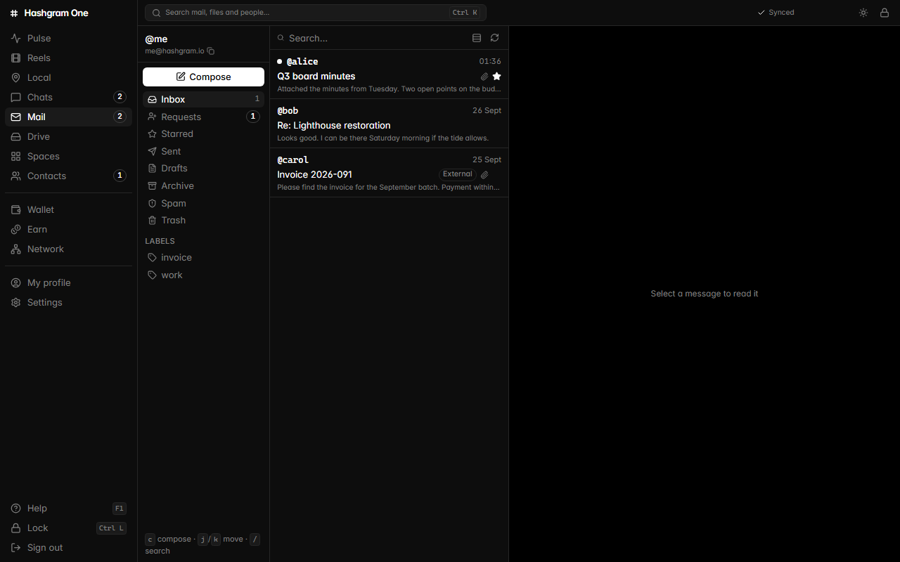
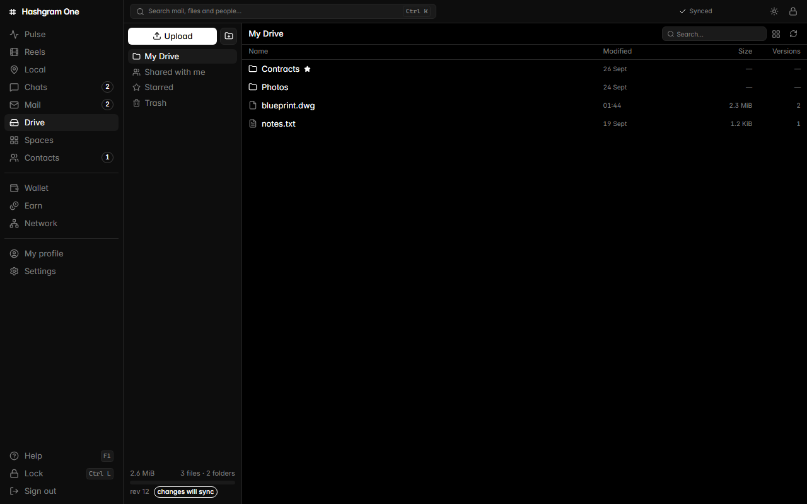
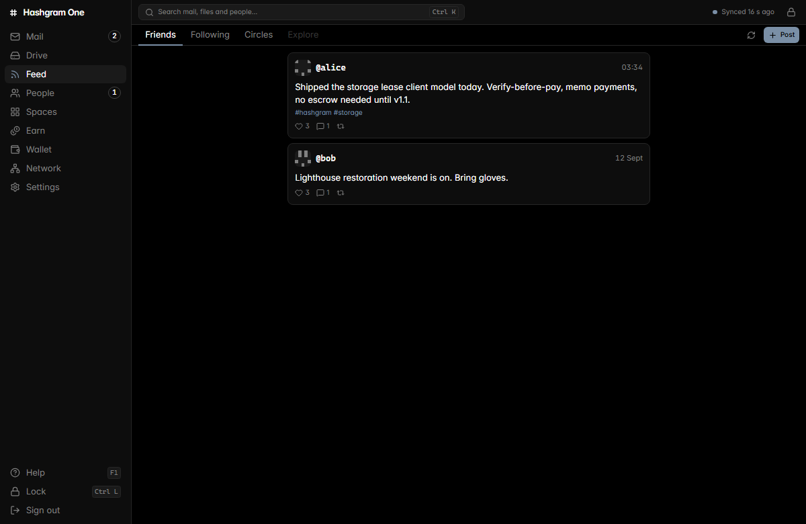
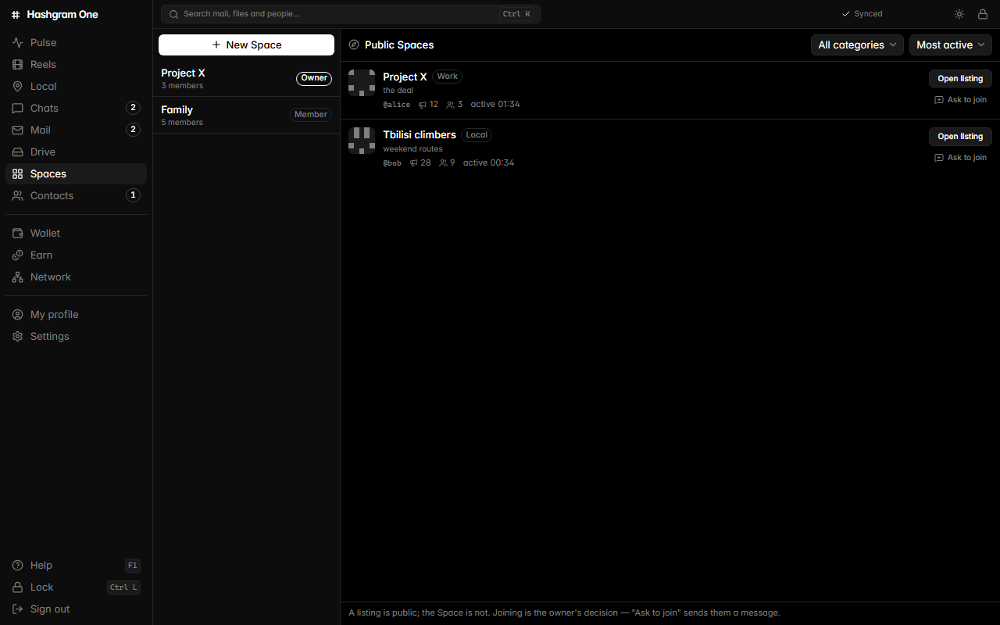
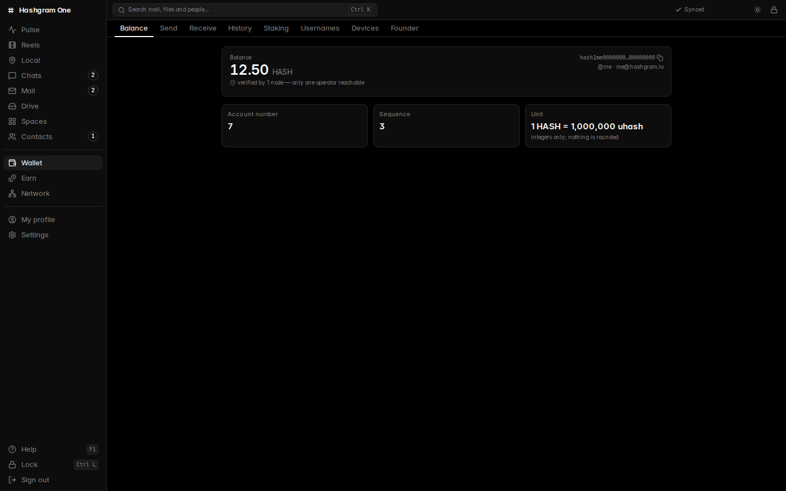
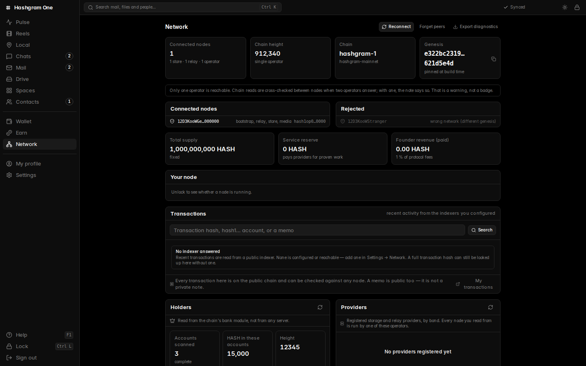
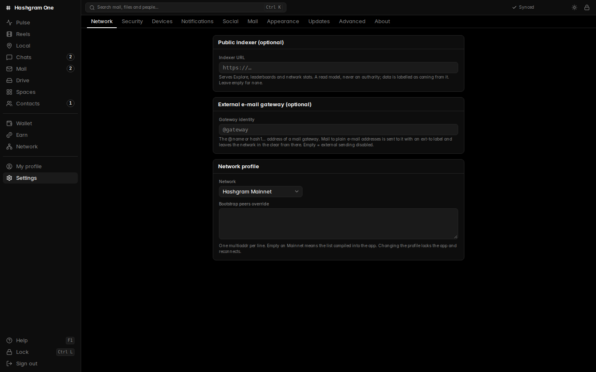
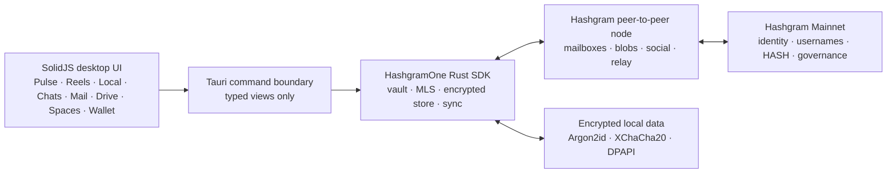

<div align="center">

<picture>
  <source media="(prefers-color-scheme: dark)" srcset="brand/wordmark-white-512.png">
  <source media="(prefers-color-scheme: light)" srcset="brand/wordmark-black-512.png">
  
</picture>

<br><br>

# Hashgram One for Windows

### One identity. One inbox. One vault. One network.

[](#this-is-a-demo)
[](https://github.com/deepdrogo/hashgram_windows/releases/latest)
[](https://hashgram.io)
[](#download)
[](#architecture)
[](LICENSE)

<br>

> **This is a demo / public preview.** Hashgram One for Windows is under
> active development. Expect rough edges, SmartScreen warnings on first
> install, and behaviour that can still change. Use it to explore the
> product — not as a finished production client.

<br>

Private **Pulse**, **Reels**, **Local**, **Chats**, **Mail**, encrypted **Drive**,
**Spaces**, **Contacts**, **Earn**, **Wallet** and **Network** — one native
desktop app talking to Hashgram's peer-to-peer network, never to one central server.

<br>

[**Download v1.6.1**](https://github.com/deepdrogo/hashgram_windows/releases/latest) ·
[**Explore the network**](https://hashgram.io) ·
[**Protocol source**](https://github.com/deepdrogo/hashgram) ·
[**Security model**](docs/SECURITY.md) ·
[**Desktop architecture**](apps/desktop/README.md)

<br>



</div>

---

## This is a demo

| | |
|---|---|
| **Status** | Public **demo / preview** — not a finished production release |
| **Latest build** | **[v1.6.1](https://github.com/deepdrogo/hashgram_windows/releases/tag/v1.6.1)** (26 September 2026) |
| **Signing** | Updater packages are minisign-verified; the installer is still an **unsigned preview** (Windows SmartScreen may warn) |
| **Audience** | Testers, contributors and anyone who wants to see Hashgram One on Windows |
| **Not yet** | Authenticode certificate, full clean-Windows definition-of-done pass, multi-PC production hardening |

Feedback is welcome. Treat balances, social posts and chats on this build as
**preview behaviour** while the product hardens.

---

## What Hashgram One is

Hashgram One is the user-facing workspace on Hashgram Mainnet. The chain
holds globally agreed identity keys, usernames, balances, provider records
and governance. Private application data does **not** go on chain: mail,
chats, contacts, file names, folder trees, private feeds and Space activity
travel inside MLS ciphertext that relay and storage nodes cannot read.

Version **1.6.1** is a social-first desktop client: Pulse opens first, with
Stories, photo/video posts, Reels, Local (self-declared country), MLS Chats,
Mail, Drive, public and closed Spaces, a buyable on-chain verified badge,
Wallet, Earn and Network — all behind one 24-word identity.

| | |
|---|---|
| **Application** | Hashgram One **1.6.1** · demo preview |
| **Platform** | Windows 10/11 x64 · Tauri 2 · WebView2 |
| **Identity** | One locally generated or restored 24-word identity |
| **Network** | Hashgram Mainnet (`hashgram-1`) through the peer-to-peer SDK |
| **Local data** | Encrypted vault, encrypted SDK store and sealed UI cache |
| **Updates** | Minisign-verified manifest and package from GitHub Releases |
| **Source** | Apache-2.0 |

---

## What's inside v1.6.1

```text
 Social          Assets & network       You
 ─────────────   ──────────────────     ────────────
 Pulse           Wallet                 My profile
 Reels           Earn                   Settings
 Local           Network
 Chats
 Mail
 Drive
 Spaces
 Contacts
```

### Pulse — social home

- Opens on launch: chronological **Latest**, **Following** and **Topics**.
- No ranking algorithm — what you see is what the nearest node holds, newest first.
- **Stories** in a ring row; photo and video posts with hashtags.
- Topics are open subject pages anyone can start and write on.
- Discovery without a mandatory central indexer.

### Reels & Local

- **Reels** — short video as its own rail section (first frame, autoplay, starts silent).
- **Local** — posts, media, people and Spaces filtered by a **self-declared** country on the author's profile. Nothing is inferred from IP, peer or language.

### Chats

- Private 1:1 and **group** conversations over MLS.
- Emoji, pictures, video and file attachments.
- Messages land in sealed local history first (works offline); status is honest: queued vs sent — never a fake "read" receipt.

### Mail

- End-to-end encrypted HashMail between `hash1…`, `@username` and `name@hashgram.io`.
- Inbox, Requests, Starred, Sent, Drafts, Archive, Spam, Trash and labels.
- Threads, CC/BCC, receipts, Drive attachments, sandboxed HTML under a strict CSP.
- Keyboard workflow: `c` compose, `j/k` move, `Enter` open, `r` reply, `e` archive.

### Drive

- Client-side encrypted files in authenticated 1 MiB segments.
- Folders, list/grid, versions, star, trash, snapshot/live capability sharing.
- Deterministic encrypted manifests that converge across devices.

### Spaces & Contacts

- Private (closed) and public Spaces with Owner / Admin / Member / Guest roles
  from a signed, hash-chained role log.
- Posts, announcements, shared Drive and member management.
- Contacts with on-chain identity resolution; local friend / block / mute / trust.

### My profile & verified badge

- Avatar, bio, username, activity, walls and full publish history.
- Optional **verified badge**: a public on-chain payment + profile claim that
  every reader re-checks — not granted or revoked by a central operator.
  The UI states the price, where HASH goes, and what the badge does **not** prove.

### Wallet, Earn & Network

- HASH balance, send/receive, history, staking, usernames and authorised devices.
- Transaction amounts stay integer strings end to end; preview before sign.
- Run or supervise a useful-service node; inspect assignments and earnings.
- Network height, peers, genesis, supply, providers and a transaction explorer surface.
- Diagnostics export excludes private content, contact addresses and peer IPs.

### Desktop platform

- The app can **run the Hashgram node** itself and reports what it is really doing.
- Dark / light themes, command palette (`Ctrl+K`), auto-lock, encrypted backup/restore.
- Signed self-update through GitHub Releases.
- Device registration gated until the PC is authorised on chain
  (≥ 0.01 HASH; username registration costs 1 HASH).

---

## Screenshots

<table>
<tr>
<td width="50%" align="center"><br><sub><b>Mail</b> — encrypted inbox, requests, labels and local drafts</sub></td>
<td width="50%" align="center"><br><sub><b>Drive</b> — encrypted folders, versions and capability sharing</sub></td>
</tr>
<tr>
<td width="50%" align="center"><br><sub><b>Pulse</b> — chronological social home, topics and media</sub></td>
<td width="50%" align="center"><br><sub><b>Spaces</b> — public and closed role-based workspaces</sub></td>
</tr>
<tr>
<td width="50%" align="center"><br><sub><b>Wallet</b> — HASH, staking, usernames and devices</sub></td>
<td width="50%" align="center"><br><sub><b>Network</b> — peers, chain identity, supply and diagnostics</sub></td>
</tr>
<tr>
<td colspan="2" align="center"><br><sub><b>Settings</b> — network, security, devices, updates and appearance</sub></td>
</tr>
</table>

> Screenshots are from the built-in development data shim. They show real UI
> routes without exposing a real identity, message, wallet or network credential.
> Some newer surfaces (Reels, Local, Chats, Stories) may look ahead of these stills —
> the live **demo** build is the source of truth.

---

## Security and privacy

### The webview never receives secret material

The Tauri frontend receives typed views, not cryptographic objects. The
mnemonic (except its one-time onboarding display and restore field), root
private key, device seed, Drive keys, MLS state, vault passphrase and local
store key remain in Rust.

### Local protection

- Argon2id derives the vault key from the passphrase.
- XChaCha20-Poly1305 seals local records.
- DPAPI and optional Windows Hello protect day-to-day unlock.
- UI caches use SQLite WAL with sensitive columns sealed under a vault-held key.
- Temporary decrypted attachments are wiped when the app locks.
- Auto-lock defaults to 15 minutes.
- Recovery words are never copied by the app and blur when the window loses focus.

### Network boundaries

- The desktop talks through the in-repository `HashgramOne` SDK.
- `chain_api = None`: there is no mandatory central API.
- Bootstrap peers come from the Mainnet parameter set; one hostname is never made load-bearing.
- A peer with the wrong genesis is rejected and shown as a wrong-network peer.
- Private payloads remain MLS-encrypted while stored or relayed.

### Tests enforce the boundary

- Command return types are checked for forbidden secret fields.
- Rust tests inspect files written by the app for plaintext keys, mnemonics, mail, drafts and Drive metadata.
- HTML mail is tested for an empty sandbox and strict CSP.
- Notifications are prohibited from containing subjects or file names.
- Source rules reject hard-coded non-loopback IPs, CDN/analytics references, floating-point token amounts and forbidden terminology.

---

## How it works


```mermaid
flowchart LR
  UI["SolidJS desktop UI<br/>Pulse · Reels · Local · Chats · Mail · Drive · Spaces · Wallet"]
  T["Tauri command boundary<br/>typed views only"]
  SDK["HashgramOne Rust SDK<br/>vault · MLS · encrypted store · sync"]
  P2P["Hashgram peer-to-peer node<br/>mailboxes · blobs · social · relay"]
  CHAIN["Hashgram Mainnet<br/>identity · usernames · HASH · governance"]
  LOCAL["Encrypted local data<br/>Argon2id · XChaCha20 · DPAPI"]

  UI --> T --> SDK
  SDK <--> LOCAL
  SDK <--> P2P
  P2P <--> CHAIN
```

---

## Download

The latest public **demo** build is
**[Hashgram One for Windows v1.6.1](https://github.com/deepdrogo/hashgram_windows/releases/tag/v1.6.1)**.

| File | Use |
|---|---|
| `Hashgram.One_1.6.1_x64-setup.exe` | Recommended per-user NSIS installer |
| `Hashgram.One_1.6.1_x64_en-US.msi` | MSI package |
| `SHA256SUMS.txt` | Published SHA-256 checksums |
| `latest.json` + `.sig` files | Signed updater manifest and package signatures |

Installs per user (no admin). Data lives in `%LOCALAPPDATA%\Hashgram\data`.

The updater refuses an unsigned or foreign manifest. This preview is
**not Authenticode-signed yet**, so Windows SmartScreen may warn on first
install. Verify the package against `SHA256SUMS.txt`. About shows
`unsigned preview`. This limitation is stated explicitly rather than hidden.

---

## Architecture

| Layer | Technology | Responsibility |
|---|---|---|
| UI | SolidJS · TypeScript · Vite · Tailwind | Routes, views, accessibility, local interaction |
| Desktop core | Tauri 2 · Rust | Commands, session, vault, sync, files, notifications, optional local node |
| Application boundary | `hashgram-sdk` / `HashgramOne` | Mail, Drive, Chats, Pulse, Spaces, Wallet, provider and network surfaces |
| Local state | encrypted SDK store · sealed SQLite cache | Offline views, indexes and settings |
| Network | Rust libp2p node + Cosmos SDK / CometBFT chain | Ciphertext relay/storage and global consensus |

Read the implementation guide in
[`apps/desktop/README.md`](apps/desktop/README.md)
and the protocol boundary in
[`docs/HASHGRAM_ONE_ARCHITECTURE.md`](docs/HASHGRAM_ONE_ARCHITECTURE.md).

---

## Develop

```powershell
pnpm install
cd apps\desktop
pnpm test
pnpm exec tsc --noEmit
pnpm tauri dev
```

For UI-only work, `pnpm dev` uses an in-memory development shim that is
tree-shaken from production builds.

---

## Related projects

| Project | Purpose |
|---|---|
| [deepdrogo/hashgram](https://github.com/deepdrogo/hashgram) | Mainnet chain, P2P node, protocol, SDK, indexer and operator tooling |
| [hashgram.io](https://hashgram.io) | Live read-only explorer, network dashboard and documentation |
| [deepdrogo/hashgram_io](https://github.com/deepdrogo/hashgram_io) | Explorer website and read API contract |

## Licence

Apache-2.0 — see [LICENSE](LICENSE). The Hashgram mark and wordmark identify
the Hashgram network; use them unmodified when referring to it.
