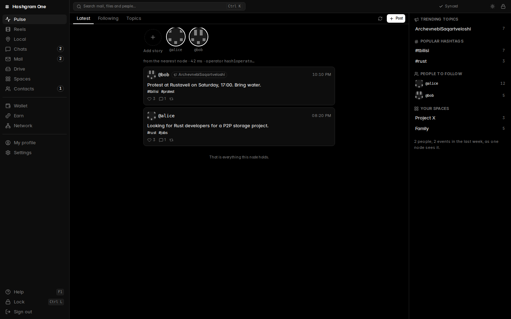
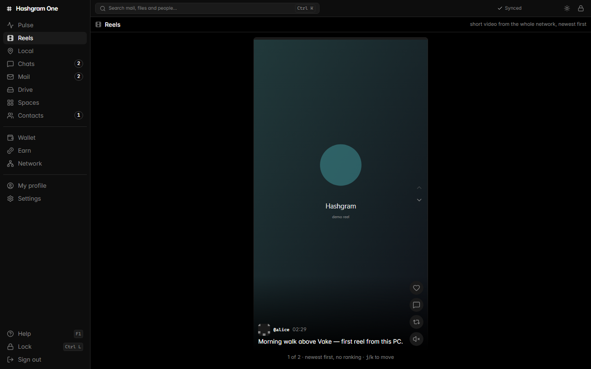
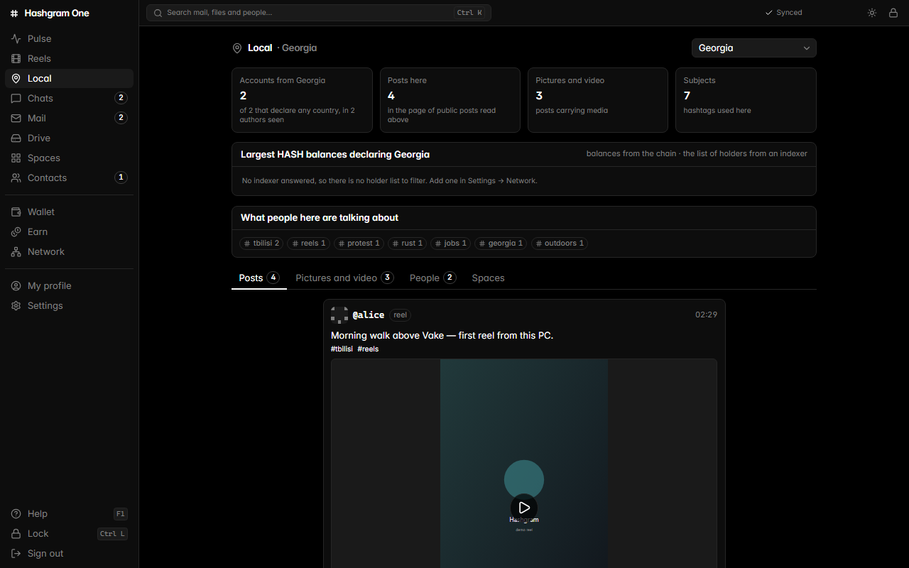
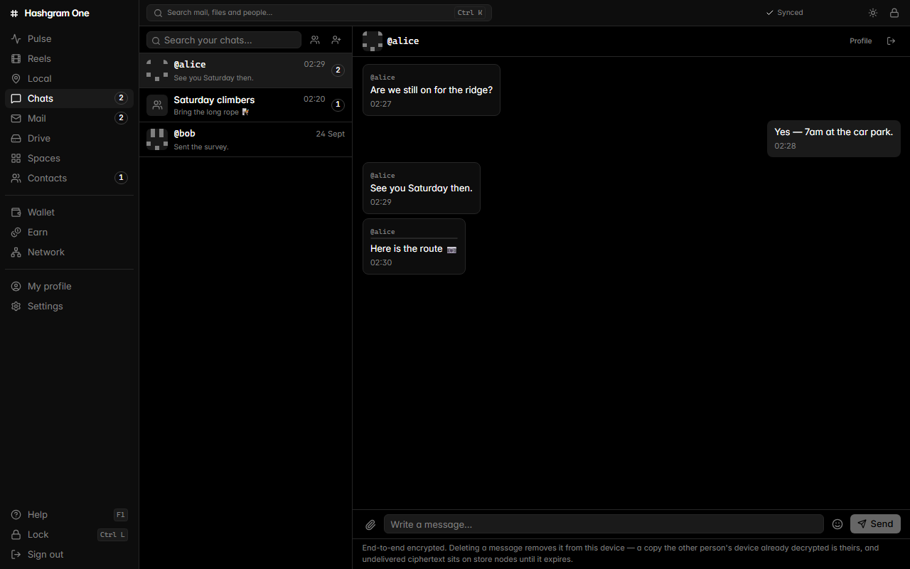
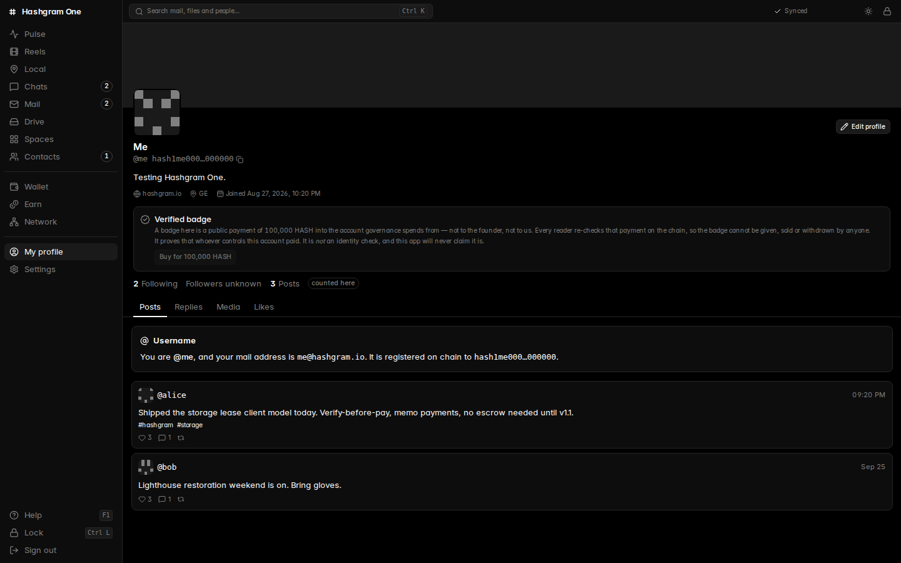
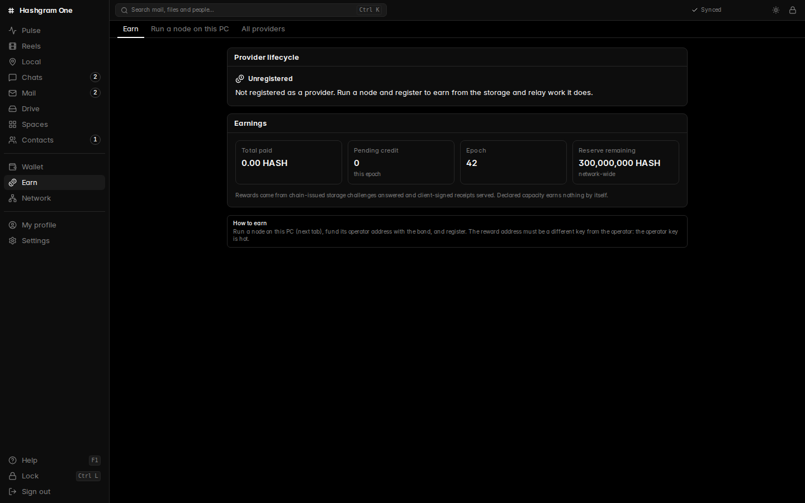
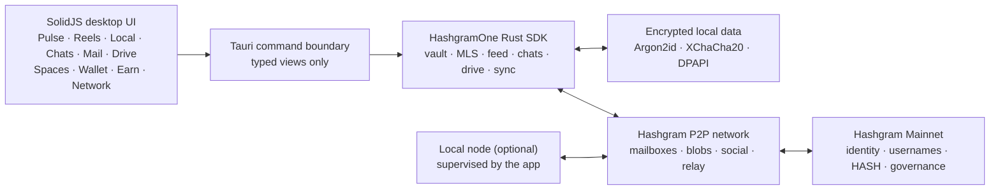

<div align="center">

<picture>
  <source media="(prefers-color-scheme: dark)" srcset="brand/wordmark-white-512.png">
  <source media="(prefers-color-scheme: light)" srcset="brand/wordmark-black-512.png">
  
</picture>

<br><br>

# Hashgram One for Windows

### A social network, a private messenger, mail, a drive and a wallet —<br>on one identity, with no central server.

Pulse · Reels · Local · Chats · Mail · Drive · Spaces · Contacts · Wallet · Earn · Network

<br>

[](#-this-is-a-demo)
[](https://github.com/deepdrogo/hashgram_windows/releases/latest)
[](https://hashgram.io)
<br>
[](#-download)
[](#-architecture)
[](#-security-and-privacy)
[](LICENSE)

<br>

[**Download the demo**](https://github.com/deepdrogo/hashgram_windows/releases/latest) ·
[**What's new**](#-whats-new-in-1x) ·
[**Features**](#-features) ·
[**Screenshots**](#-screenshots) ·
[**Limitations**](#-known-limitations) ·
[**Explore the network**](https://hashgram.io)

<br>



</div>

<br>

> [!WARNING]
> ## 🧪 This is a demo
>
> **Hashgram One for Windows is an early public demo, not a finished product.**
> It runs against the live Hashgram Mainnet and the features below really work,
> but it is shipped so people can try it and report problems — not yet for data
> or money you cannot afford to lose.
>
> - Expect bugs, rough edges and frequent updates (the app updates itself).
> - The installer is **not Authenticode-signed yet**, so Windows SmartScreen will warn on first run.
> - The network currently depends on a **single validator** — if it stops, the chain stops.
> - Keep your **24 recovery words** written down offline. Nobody, including us, can restore them.
>
> See [Known limitations](#-known-limitations) for the full, honest list.

---

## ✨ What Hashgram One is

Hashgram One is the desktop client for **Hashgram**, a peer-to-peer network with
its own chain. The chain holds only what must be globally agreed — identity keys,
usernames, HASH balances, providers and governance. Everything private — chats,
mail, files, contacts, Spaces — travels as **MLS ciphertext** that relay and
storage nodes cannot read.

One locally generated **24-word identity** is your account for everything.
There is no sign-up server, no password reset and no company in the middle.

| | |
|---|---|
| **Version** | Hashgram One **1.6.1** · demo |
| **Platform** | Windows 10/11 x64 · Tauri 2 · WebView2 |
| **Identity** | One 24-word identity, generated or restored on this PC |
| **Network** | Hashgram Mainnet (`hashgram-1`) over the peer-to-peer SDK |
| **Local data** | Encrypted vault, encrypted SDK store, sealed SQLite cache |
| **Updates** | Minisign-verified, from GitHub Releases |
| **Tests** | 210 frontend assertions · 111 Rust tests · clippy clean |
| **Source** | Apache-2.0 |

---

## 🚀 What's new in 1.x

Between **0.3.1** and **1.6.1** Hashgram One turned from an encrypted mail-and-drive
client into a **social-first application**. Highlights:

| Version | What arrived |
|---|---|
| **0.4 – 0.6** | **Pulse** becomes the home screen; social-first navigation; real **social profiles** (cover, avatar, bio, website, country); Latest / Following / Topics feeds with a discovery column |
| **0.7** | **Photo and video posts** with poster frames, lazy tiles and a lightbox; three-provider replication |
| **0.8** | **Stories** — 6/12/24/48 h, fullscreen viewer, honest expiry wording |
| **0.9** | **Chats** — private end-to-end encrypted conversations, stored sealed on the PC |
| **0.10** | Your `@name` / `name@hashgram.io` address in Mail; **real Drive availability** checks |
| **0.11** | **The app runs the node itself** — live state, pre-flight checks, log viewer |
| **0.12** | Single points of failure named and traced; multiple indexers; DNS bootstrap |
| **1.0** | Light theme fixed; full social report in [`docs/HASHGRAM_ONE_SOCIAL_REPORT.md`](docs/HASHGRAM_ONE_SOCIAL_REPORT.md) |
| **1.1** | **Group chats** (up to 64), **emoji picker**, **Space chat**, member search for large Spaces |
| **1.2** | **Pictures, video and files in Chats**, encrypted per file |
| **1.3** | **Reels**, a **transaction explorer**, a **public Spaces directory**, the **verified badge**, big speed-ups |
| **1.4** | Pure monochrome design; **Reels** and **Local** as their own sections; closed Spaces proven closed |
| **1.5** | Video shows its first frame, autoplays **muted**, no layout jumps |
| **1.6** | MLS group fix so **chats work between clients**; a stable timeline with "N new posts"; the **badge purchase works end to end** |

Full notes for every release: [Releases](https://github.com/deepdrogo/hashgram_windows/releases).

---

## 🧭 Features

### 📡 Pulse — the social home

- **Latest** (public posts from the nearest node), **Following** (from people's own
  signed chains, works offline) and **Topics**.
- **Stories** row at the top: picture or video with a caption, for 6, 12, 24 or 48 hours.
- **Photo and video posts** with poster frames, reserved sizes and a real lightbox.
- Discovery column: trending topics, hashtags, people to follow and your Spaces —
  plain counts over signed events, **no ranking algorithm**.
- New posts wait behind a **"3 new posts"** button instead of moving what you are reading.

### 🎬 Reels

- Short video from the whole network, **newest first**, no ranking, no view counts.
- Next videos are pre-warmed so scrolling does not stall; playback starts muted.

### 📍 Local

- One country's accounts, posts, pictures and video, subjects, Spaces and largest HASH balances.
- A country is only ever **self-declared** in a signed profile — there is **no geolocation**
  anywhere in the app, and a test enforces it.

### 👤 Profiles

- Cover, avatar, display name, `@username`, bio, website and country.
- Posts / Replies / Media / Likes tabs over the author's own signed events.
- Follow, Contact, Chat and Mail from any profile.
- **Verified badge**: a public 100,000 HASH payment to the governance account — not to
  the founder. Every reader re-checks the payment on chain; it cannot be given, sold or revoked.

### 💬 Chats

- One-to-one and **group chats** (up to 64 people) over MLS end-to-end encryption.
- **Pictures, video and files** — each file encrypted with its own key; nodes hold ciphertext only.
- Emoji picker, instant local send, offline queue, honest "waiting / sent" states.
- **Who can message you** — Everyone or Nobody — enforced on the receiving side.
- History is sealed in the local database; search decrypts on your PC only.

### ✉️ Mail

- End-to-end encrypted HashMail to `hash1…`, `@username` and `name@hashgram.io`.
- Inbox, Requests, Starred, Sent, Drafts, Archive, Spam, Trash and labels.
- Requests workflow for unknown senders; hashcash "postage stamp" against spam.
- HTML mail isolated in a sandboxed iframe under a strict CSP.
- Keyboard workflow: `c` compose · `j/k` move · `Enter` open · `r` reply · `e` archive.

### 📁 Drive

- Client-side encrypted files in authenticated segments; folders, versions, star, trash.
- Snapshot and live capability sharing, revocable at any time.
- **Real availability**: "2 of the 3 nodes that answered hold a complete copy" — never a fake green badge.

### 🏢 Spaces

- Private workspaces for a family, team or company: Overview, **Chat**, Posts, Drive, Members, Mail.
- Owner / Admin / Member / Guest roles from a signed, hash-chained role log.
- **Public directory**: an owner may *list* a Space so it can be found; the Space itself stays
  a closed MLS group and "Ask to join" messages the owner.

### 💰 Wallet, Earn and Network

- HASH balance, send/receive, history, staking, usernames and authorised devices.
- **Run a node from this PC**: the app supervises it, shows state, peers, height, storage and logs.
- Provider lifecycle, epochs and earnings from chain-issued storage challenges.
- **Transaction explorer**: search by hash, account or memo.
- Chain identity, pinned genesis, peers, supply, holders and providers — all shown with their source.

---

## 🖼 Screenshots

Captured from the live **v1.6.1 demo** UI (development shim — synthetic data, no real keys).

<table>
<tr>
<td width="50%" align="center"><br><sub><b>Pulse</b> — stories, reels, public posts, topics and people</sub></td>
<td width="50%" align="center"><br><sub><b>Reels</b> — short video from the network, newest first</sub></td>
</tr>
<tr>
<td width="50%" align="center"><br><sub><b>Local</b> — one country, self-declared, never geolocated</sub></td>
<td width="50%" align="center"><br><sub><b>Chats</b> — end-to-end encrypted, one-to-one and groups</sub></td>
</tr>
<tr>
<td width="50%" align="center"><br><sub><b>Mail</b> — encrypted inbox with your @name address</sub></td>
<td width="50%" align="center"><br><sub><b>Drive</b> — encrypted folders, versions and sharing</sub></td>
</tr>
<tr>
<td width="50%" align="center"><br><sub><b>Spaces</b> — private, role-based workspaces</sub></td>
<td width="50%" align="center"><br><sub><b>Profile</b> — cover, username, verified badge and posts</sub></td>
</tr>
<tr>
<td width="50%" align="center"><br><sub><b>Wallet</b> — HASH, staking, usernames and devices</sub></td>
<td width="50%" align="center"><br><sub><b>Network</b> — peers, chain, supply and transaction explorer</sub></td>
</tr>
<tr>
<td width="50%" align="center"><br><sub><b>Earn</b> — run a node and earn from useful work</sub></td>
<td width="50%" align="center"><br><sub><b>Settings</b> — network, security, devices and appearance</sub></td>
</tr>
</table>

> Screenshots are rendered from the application's built-in development data shim.
> They show the real 1.6.1 interface without exposing any real identity, message,
> wallet or network credential.
>
> Regenerate: `pnpm dev` in `apps/desktop`, then
> `node apps/desktop/scripts/capture-desktop-screens.mjs`.

---

## 🔐 Security and privacy

**The webview never receives secret material.** The frontend gets typed views,
not cryptographic objects. The mnemonic (except its one-time display and the
restore field), root key, device seed, Drive and chat-attachment keys, MLS state,
vault passphrase and local store key all stay in Rust.

**Local protection**

- Argon2id derives the vault key; XChaCha20-Poly1305 seals local records.
- DPAPI and optional Windows Hello for day-to-day unlock; auto-lock after 15 minutes.
- Chat history and UI caches live in SQLite with sensitive columns sealed under a vault-held key.
- Temporary decrypted files and in-memory caches are wiped when the app locks.

**Network boundaries**

- No mandatory central API (`chain_api = None`); bootstrap from Mainnet parameters and DNS.
- Peers with the wrong genesis are rejected and shown as wrong-network peers.
- Private payloads stay MLS-encrypted while stored or relayed.
- Anti-spam on nodes: per-author rate limits; floods are dropped silently.

**Tests enforce the boundary**

- Command return types are checked for forbidden secret fields.
- Rust tests grep everything the app writes to disk for keys, mnemonics, mail, chats and file names.
- Source rules forbid geolocation, hard-coded IPs, analytics/CDNs, floating-point amounts,
  non-grey colour tokens and full page reloads.

---

## 🧱 Architecture


```mermaid
flowchart LR
  UI["SolidJS desktop UI<br/>Pulse · Reels · Local · Chats · Mail · Drive<br/>Spaces · Wallet · Earn · Network"]
  T["Tauri command boundary<br/>typed views only"]
  SDK["HashgramOne Rust SDK<br/>vault · MLS · feed · chats · drive · sync"]
  NODE["Local node (optional)<br/>supervised by the app"]
  P2P["Hashgram P2P network<br/>mailboxes · blobs · social · relay"]
  CHAIN["Hashgram Mainnet<br/>identity · usernames · HASH · governance"]
  LOCAL["Encrypted local data<br/>Argon2id · XChaCha20 · DPAPI"]

  UI --> T --> SDK
  SDK <--> LOCAL
  SDK <--> P2P
  NODE <--> P2P
  P2P <--> CHAIN
```

| Layer | Technology | Responsibility |
|---|---|---|
| UI | SolidJS 1.9 · TypeScript 5.9 · Vite 7 · Tailwind 4 | Routes, views, accessibility, interaction |
| Desktop core | Tauri 2 · Rust | Commands, session, vault, sync, media, node supervisor |
| Application boundary | `hashgram-sdk` / `HashgramOne` | Social, chats, mail, drive, spaces, wallet, provider and network |
| Local state | encrypted SDK store · sealed SQLite | Offline views, chat history, indexes, settings |
| Network | Rust libp2p node · Cosmos SDK / CometBFT chain | Ciphertext relay/storage and global consensus |

More detail: [`apps/desktop/README.md`](apps/desktop/README.md) ·
[`docs/HASHGRAM_ONE_ARCHITECTURE.md`](docs/HASHGRAM_ONE_ARCHITECTURE.md) ·
[`docs/HASHGRAM_ONE_SOCIAL_REPORT.md`](docs/HASHGRAM_ONE_SOCIAL_REPORT.md) ·
[`docs/STORIES.md`](docs/STORIES.md) · [`docs/SPACES.md`](docs/SPACES.md)

---

## 📦 Download

Get the latest demo from **[Releases → latest](https://github.com/deepdrogo/hashgram_windows/releases/latest)**.

| File | Use |
|---|---|
| `Hashgram.One_<version>_x64-setup.exe` | Recommended per-user installer (no admin needed) |
| `Hashgram.One_<version>_x64_en-US.msi` | MSI package |
| `SHA256SUMS.txt` | SHA-256 checksums — verify before installing |
| `latest.json` + `.sig` | Signed updater manifest and package signatures |

Once installed, the app checks for updates itself and refuses any unsigned or foreign
update manifest.

> [!NOTE]
> Because the demo is not Authenticode-signed yet, SmartScreen shows
> *"Windows protected your PC"*. Choose **More info → Run anyway** after checking
> the file against `SHA256SUMS.txt`.

---

## ⚠️ Known limitations

Stated plainly, because this is a demo:

- **One validator.** The chain halts if that machine stops. Adding validators is an operations task, not a code change.
- **DNS bootstrap record not published yet** — new installs rely on the compiled-in bootstrap peers.
- **Follower counts need an indexer.** Without one they show as *unknown* rather than a guess.
- **Replication is best-effort.** Three providers are targeted; the UI reports what answered, not a guarantee.
- **No video transcoding**, by design. Only formats WebView2 can play (H.264/AAC MP4, WebM) play inline; others open in the system player.
- **Stories** have no viewer count, reactions or replies yet.
- **Local** depends on people declaring a country on their profile.
- **English only** for now; the Georgian translation was withdrawn until it is complete.
- **Not Authenticode-signed** yet; clean-machine and multi-PC QA is still in progress.

Found a bug? Please [open an issue](https://github.com/deepdrogo/hashgram_windows/issues) — for security problems see [SECURITY.md](SECURITY.md).

---

## 🛠 Develop

```powershell
cd apps\desktop
pnpm install
pnpm test                 # vitest
pnpm exec tsc --noEmit
pnpm tauri dev            # full app (needs the Rust toolchain)
pnpm dev                  # UI only, in a browser, against an in-memory dev shim
```

The dev shim is tree-shaken from production builds. Release, signing and
self-update details are in [`apps/desktop/README.md`](apps/desktop/README.md).

---

## 🔗 Related projects

| Project | Purpose |
|---|---|
| [deepdrogo/hashgram](https://github.com/deepdrogo/hashgram) | Mainnet chain, P2P node, protocol, SDK, indexer and operator tooling |
| [hashgram.io](https://hashgram.io) | Live explorer, network dashboard and documentation |
| [deepdrogo/hashgram_io](https://github.com/deepdrogo/hashgram_io) | Explorer website and read API |

## 📄 Licence

Apache-2.0 — see [LICENSE](LICENSE). The Hashgram mark and wordmark identify the
Hashgram network; use them unmodified when referring to it.

<div align="center">
<br>
<sub><b>Hashgram One</b> · demo · one identity, one network, no central server</sub>
</div>
