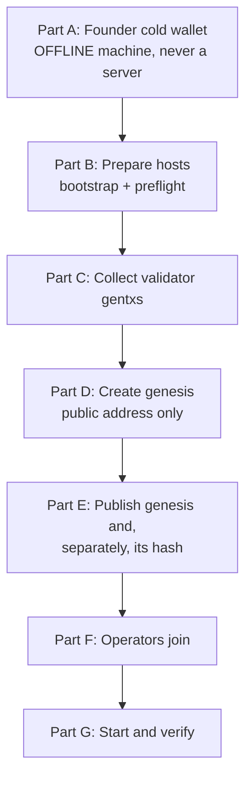

# Founder Launch Runbook

The complete sequence for launching Hashgram Mainnet, in order, with the
commands.

Read the whole thing before starting Part A. Several steps are irreversible,
and one of them — creating the Founder key — determines control of 20% of the
supply forever.

## A note on your seed phrase

**Nothing in this repository will ever ask for your seed phrase, and neither
will anyone legitimately helping you.**

`hashgram-keygen` prints a mnemonic once, to your terminal, on a machine you
control that is not connected to a network. Nothing else ever needs to see it:
not this server, not the genesis tooling, not a support channel, not a
document. The only thing that leaves the offline machine is a public address
beginning `hash1`.

If any tool, script, person or web page asks you to type or paste your seed
phrase, that is an attack. There is no exception to this and no situation in
which it is a reasonable request.

## Overview



Estimated time: Part A takes an hour done carefully. Parts B through D take a
day. Part F depends on your operators. Do not compress Part A.

---

## Part A — Create the Founder cold wallet

**Where:** a machine that has never been a server and is not connected to a
network while you do this. A laptop with Wi-Fi switched off is acceptable. A
VPS is not, under any circumstances.

**Why offline:** this key controls 200,000,000 HASH. A key generated on a
server has been, however briefly, on a machine reachable from the internet and
running software you did not audit. There is no way to un-know that.

### A.1 Get the binary onto the offline machine

Build it on a connected machine, verify it, and carry it across on a USB
stick:

```bash
make build
sha256sum build/hashgram-keygen
```

Record that checksum. On the offline machine, verify it matches before
running anything.

### A.2 Confirm the machine is offline

```bash
ip link set wlan0 down     # or unplug the cable
ping -c 1 8.8.8.8          # must fail
```

`hashgram-keygen` contains no networking code and writes nothing to disk. That
is a property of the binary and it is not a reason to skip this step: defence
in depth means the tool being safe *and* the machine being offline.

### A.3 Generate

```bash
./hashgram-keygen new
```

It prints a warning, then a mnemonic, then the derived `hash1...` address.

### A.4 Write the mnemonic on paper

By hand. On paper. Twice.

**Never:** photograph it, type it into any computer, store it in a password
manager that syncs, put it in a note-taking app, email it to yourself, or read
it aloud near a phone.

Store the two copies in two separate physical locations. Consider a metal
backup plate if the amount matters to you, because paper burns and gets wet.

### A.5 Verify the backup by deriving the address

This is the step that catches a transcription error while it is still fixable:

```bash
./hashgram-keygen derive
```

Type the mnemonic from your **written copy**, not from the screen. Compare the
address it derives against the one printed in A.3.

**They must match exactly.** All of it, not the first and last few characters.

Be precise about what BIP-39's checksum does for you here: it catches most
single-word errors and most typos. It does **not** reliably catch two words
being swapped, because a swap can still produce a valid checksum. So the
mnemonic being *accepted* is not the verification. The **derived address
matching** is the verification.

### A.6 Record the public address

```text
Founder public address: hash1________________________________
```

Write it down separately from the mnemonic. You will type it on the server in
Part D, and it is the only thing from this part that goes anywhere near a
server.

### A.7 Consider a hardware wallet instead

Hashgram uses BIP-44 coin type 118, which is Cosmos's, so a Ledger works with
standard Cosmos tooling. If you have one, using it is better than a paper
mnemonic: the key is generated on the device and never exists in a form that
can be transcribed wrongly or photographed.

You still record the address. You still write down the device's own recovery
words, with the same discipline as A.4.

### Part A checklist

- [ ] Machine has never been a server and is offline now
- [ ] Binary checksum verified against the one recorded on the build machine
- [ ] Mnemonic written on paper, by hand, twice
- [ ] Two copies in two separate physical locations
- [ ] Mnemonic never photographed, typed, or stored digitally
- [ ] Backup verified by comparing the **derived address**, not just acceptance
- [ ] Public address recorded separately
- [ ] Offline machine's disk wiped, or the machine kept permanently offline

---

## Part B — Prepare the hosts

**Where:** each server that will run a node.

### B.1 Install

```bash
sudo ./scripts/install/bootstrap-ubuntu.sh
```

Creates the five per-role service users, sets up directories, installs
binaries and hardened systemd units, configures PostgreSQL for localhost only,
and sets a default-deny firewall.

The firewall step detects the port `sshd` is actually listening on rather than
assuming 22. Verify you can still open a second SSH session before closing the
first one.

### B.2 Initialise the node

```bash
hashgramctl init --moniker <name>
```

### B.3 Monitoring

```bash
sudo ./scripts/install/monitoring.sh
```

Note what it reports. On a stock Ubuntu host it will rebind Prometheus,
node-exporter and the Postgres exporter to localhost, because the Debian
packages bind them to every interface — which publishes an operator's
reconnaissance feed to the internet as a side effect of installing a
dashboard.

### B.4 Harden the validator, if this host is one

In increasing order of protection, and for a validator with meaningful stake
you want at least a remote signer:

1. Confirm `priv_validator_key.json` is mode 0600
2. Set up sentry nodes so the validator has no public P2P listener
3. Move the key to `tmkms` on a separate machine
4. Back `tmkms` with an HSM

Keep the **operator key off the node entirely**. It stakes and changes
commission; the consensus key signs blocks. Separate keys, separate machines.

### B.5 Preflight until it passes

```bash
hashgramctl mainnet-preflight
```

It refuses to pass on a devnet key, a default password, a publicly reachable
admin RPC, a validator key readable by group or others, a mismatched chain id
or genesis hash, no Founder beneficiary, insufficient disk, an unsynchronised
clock, or no firewall.

Every failure names the command that fixes it. **Do not proceed until it
passes.** This gate exists so that a devnet key cannot reach a live network,
and the devnet acceptance suite verifies the gate works before it is the only
thing standing between the two.

### Part B checklist

- [ ] bootstrap-ubuntu.sh run on every host
- [ ] Second SSH session confirmed working after the firewall step
- [ ] Node initialised
- [ ] Monitoring installed; nothing listening on a public address
- [ ] Validator key at 0600, remote signer configured if stake is meaningful
- [ ] Operator key is **not** on the node
- [ ] `mainnet-preflight` passes on every host

---

## Part C — Collect validator gentxs

**Where:** the machine that will create genesis.

Each initial validator produces a gentx and sends it to you:

```bash
# On each validator's host:
hashgramd genesis gentx <key-name> <amount>uhash \
  --chain-id hashgram-1 \
  --moniker <name> \
  --ip <public-ip>
```

Collect them into the genesis machine's config directory:

```bash
cp received-gentxs/*.json /var/lib/hashgram/chain/config/gentx/
```

### On the initial validator set

This is a decision you make before the network exists, and it is listed as a
centralisation point in [DECENTRALIZATION.md](DECENTRALIZATION.md) because it
is one.

Aim for as many independent operators, in as many jurisdictions, with as even
a stake distribution as you can get. The network becomes permissionless
immediately after genesis — anyone can bond and join — but the starting set is
yours, and a starting set of one is a starting set of one.

### Part C checklist

- [ ] Gentxs from every initial validator collected
- [ ] Each gentx's chain id is `hashgram-1`
- [ ] Operators are genuinely independent, not one person with several servers
- [ ] No single operator holds a decisive share of the initial stake

---

## Part D — Create genesis

**Where:** the genesis machine. Once. Irreversibly.

### D.1 Create it

```bash
hashgramctl init-mainnet-genesis --founder-address hash1...
```

The address is the **public** one from A.6. That is the only thing this
command needs, and it is the only Founder material this server will ever see.
The tooling has no code path that generates an address, which is what makes
that guarantee structural rather than procedural.

### D.2 Read the summary before confirming

It prints the full distribution and asks for confirmation. Check:

```text
Founder                200,000,000 HASH   (20,000,000 unlocked + 180,000,000 vesting)
Service reserve        500,000,000 HASH
Treasury               150,000,000 HASH
Growth                  50,000,000 HASH
Dev grants              50,000,000 HASH
Liquidity               50,000,000 HASH
                     ─────────────────
Total                1,000,000,000 HASH
```

And that the Founder address shown is character-for-character the one you
recorded. This is the last moment at which a wrong address is fixable.

### D.3 Record the genesis hash

It prints the hash and pins it in the node's network configuration.

```text
Genesis hash: ________________________________________________________________
```

Write it down. Now, before doing anything else.

### D.4 Confirm determinism, ideally with a second person

The same inputs produce a byte-identical genesis file. Have someone else
rebuild it from the same inputs and confirm they get the same hash.

A genesis nobody else can reproduce is a genesis everybody has to trust, and
this is the cheapest possible moment to remove that requirement.

### Part D checklist

- [ ] Founder address matches A.6 exactly, character for character
- [ ] Distribution summary reviewed and correct
- [ ] Total is exactly 1,000,000,000 HASH
- [ ] Genesis hash written down
- [ ] Hash independently reproduced by a second person from the same inputs

---

## Part E — Publish

### E.1 Publish the genesis file

Anywhere operators can fetch it over HTTPS.

### E.2 Publish the hash **separately**

This is the step most often done wrong, so it is worth being explicit about
why it matters.

**A genesis file distributed alongside its own hash proves nothing.** Whoever
tampered with the file tampered with the hash sitting next to it. The hash has
to reach operators through a channel an attacker would have to compromise
separately.

Use more than one:

- Signed release notes on a tagged commit
- A published announcement on an account with history
- A third-party archive
- Directly, to each initial operator, through a channel you already share

Then any operator can cross-check two independent sources.

### Part E checklist

- [ ] Genesis file published
- [ ] Hash published through at least two channels **independent of the file**
- [ ] Each initial operator has the hash from a source they trust
- [ ] Instructions state that `--genesis-hash` is required

---

## Part F — Operators join

**Where:** every host other than the genesis machine.

```bash
hashgramctl join-mainnet \
  --genesis-url https://... \
  --genesis-hash <the hash from an independent source> \
  --peers <nodeid>@<host>:26656

hashgramctl configure-role relay,store    # optional
hashgramctl mainnet-preflight
hashgramctl start
```

`--genesis-hash` is required, and the command refuses any genesis that does
not match it. It also refuses to overwrite an existing pin without `--force`,
so a node already on one network cannot be silently moved to another.

### F.1 Every operator verifies the network they are on

```bash
hashgramctl network-info
```

Compare the pinned hash against the independently obtained one. Doing this
after joining, rather than trusting that the join worked, is the difference
between joining Hashgram and joining a fork with the same chain id.

### Part F checklist

- [ ] Every operator used `--genesis-hash` from an independent source
- [ ] Every operator ran `network-info` and confirmed the hash
- [ ] Every operator's `mainnet-preflight` passed
- [ ] Services started

---

## Part G — Start and verify

### G.1 Blocks are being produced

```bash
hashgramctl chain-status
hashgramctl status
```

### G.2 Supply is exactly right

```bash
hashgramctl chain-status
```

Total supply must be exactly `1000000000000000 uhash`. Not approximately.

```bash
hashgramd query bank total --denom uhash
```

### G.3 The Founder allocation is exactly right

```bash
hashgramctl wallet-info hash1...
```

- Total balance: 200,000,000 HASH
- Spendable now: 20,000,000 HASH
- Vesting: 180,000,000 HASH across 96 monthly periods

If the spendable figure is 200,000,000, the vesting account was not created
and something went wrong in Part D. Stop and investigate before anyone
transacts.

### G.4 The Founder revenue share is 1% and applies to fees only

```bash
hashgram-test-client founder verify --node tcp://127.0.0.1:26657
```

Reports the configured basis points (must be 100) and the realised share as a
fraction of collected revenue.

Then prove the transfer case directly. Send an amount between two accounts and
confirm the recipient receives all of it:

```bash
hashgram-test-client wallet send --from <a> --to <b> --amount 100
hashgram-test-client wallet balance <b>
```

100 HASH sent must be 100 HASH received.

### G.5 There is no mint module

```bash
hashgramd query --help | grep -c mint     # expect 0
```

And watch the metric:

```text
hashgram_supply_over_ceiling_uhash    must be 0, forever
```

### G.6 Monitoring is live

```bash
ssh -N -L 9090:127.0.0.1:9090 -L 3000:127.0.0.1:3000 operator@node
```

Confirm all three dashboards render with data, and that the alert rules
loaded:

```bash
scripts/dev/check-dashboards.sh --live
```

### G.7 A fork cannot join

Already tested by `scripts/testnet/four-validator.sh`, but worth
understanding for mainnet: a fork with a different chain id gets zero peers; a
fork sharing `hashgram-1` opens a transport connection and still cannot join
consensus or move the chain; and the layer that protects a person is the
pinned genesis hash in `join-mainnet`.

### Part G checklist

- [ ] Blocks producing steadily
- [ ] Total supply exactly 1,000,000,000,000,000 uhash
- [ ] Founder holds exactly 200,000,000 HASH
- [ ] Exactly 20,000,000 HASH spendable, 180,000,000 vesting over 8 years
- [ ] Founder fee share is exactly 100 bps
- [ ] A transfer is untaxed: 100 sent is 100 received
- [ ] No mint module; `supply_over_ceiling` is zero
- [ ] All three dashboards render with data
- [ ] Alerts loaded, none firing
- [ ] Every operator confirmed their pinned genesis hash

---

## Final checklist

Everything in one place. All of it before announcing the network.

**Founder key**
- [ ] Generated on an offline machine that was never a server
- [ ] Mnemonic on paper, by hand, two copies, two locations
- [ ] Never photographed, typed into a connected machine, or stored digitally
- [ ] Backup verified by comparing the derived address
- [ ] Only the public address ever touched a server

**Hosts**
- [ ] bootstrap-ubuntu.sh on every host
- [ ] `mainnet-preflight` passes everywhere
- [ ] Nothing on a public address except the P2P port and SSH
- [ ] Validator key 0600, remote signer if stake is meaningful
- [ ] Operator key not on the node
- [ ] Monitoring installed and reachable only over SSH

**Genesis**
- [ ] Founder address verified character for character
- [ ] Total exactly 1,000,000,000 HASH
- [ ] Hash written down
- [ ] Hash independently reproduced by a second person

**Publication**
- [ ] Genesis file published
- [ ] Hash published through at least two channels independent of the file

**Verification**
- [ ] Supply exactly 1e15 uhash
- [ ] Founder allocation and vesting correct
- [ ] Founder share 100 bps, transfers untaxed
- [ ] No mint module
- [ ] Dashboards and alerts working

**Recovery**
- [ ] Consensus and node keys backed up separately from `hashgramctl backup`
- [ ] Configuration backup automated
- [ ] Genesis hash recorded off the machine
- [ ] A restore drill completed on a spare machine

**Honesty**
- [ ] [DECENTRALIZATION.md](DECENTRALIZATION.md) section 3 read and understood
- [ ] [THREAT_MODEL.md](THREAT_MODEL.md) section 3 read and understood
- [ ] The launch announcement does not claim more than the deployment supports

---

## If something goes wrong during launch

**Before any operator joins:** you can discard the genesis and start Part D
again. Nothing is committed until blocks are produced and other people are
on the chain.

**After operators join but before real value moves:** coordinate a restart
with a corrected genesis. Awkward and embarrassing; entirely survivable.

**After the network is live:** you cannot change genesis. Everything becomes a
governance proposal or a coordinated upgrade. This is why Part D has a
confirmation prompt and why Part G verifies rather than assumes.

For anything after launch, see
[DISASTER_RECOVERY.md](DISASTER_RECOVERY.md).
